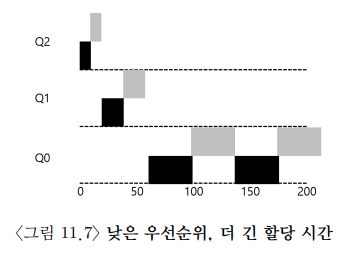

# OSTEP Chapter 11 Homework

## Problem 1

    두 개의 작업과 두 개의 큐를 무작위로 구성하여 실행시켜 보시오. 각 문제에 대한 MLFQ 실행 추적을 계산하시오. 문제를 쉽게 하기 위해 각 작업의 길이를 제한하고 입출력은 하지 않는다고 가정하시오.

**mlfq.py output**

```bash
$ python3 mlfq.py -j 2 -n 2 -c
Here is the list of inputs:
OPTIONS jobs 2
OPTIONS queues 2
OPTIONS allotments for queue  1 is   1
OPTIONS quantum length for queue  1 is  10
OPTIONS allotments for queue  0 is   1
OPTIONS quantum length for queue  0 is  10
OPTIONS boost 0
OPTIONS ioTime 5
OPTIONS stayAfterIO False
OPTIONS iobump False


For each job, three defining characteristics are given:
  startTime : at what time does the job enter the system
  runTime   : the total CPU time needed by the job to finish
  ioFreq    : every ioFreq time units, the job issues an I/O
              (the I/O takes ioTime units to complete)

Job List:
  Job  0: startTime   0 - runTime  84 - ioFreq   7
  Job  1: startTime   0 - runTime  42 - ioFreq   3


Execution Trace:

[ time 0 ] JOB BEGINS by JOB 0
[ time 0 ] JOB BEGINS by JOB 1
[ time 0 ] Run JOB 0 at PRIORITY 1 [ TICKS 9 ALLOT 1 TIME 83 (of 84) ]
[ time 1 ] Run JOB 0 at PRIORITY 1 [ TICKS 8 ALLOT 1 TIME 82 (of 84) ]
[ time 2 ] Run JOB 0 at PRIORITY 1 [ TICKS 7 ALLOT 1 TIME 81 (of 84) ]
[ time 3 ] Run JOB 0 at PRIORITY 1 [ TICKS 6 ALLOT 1 TIME 80 (of 84) ]
[ time 4 ] Run JOB 0 at PRIORITY 1 [ TICKS 5 ALLOT 1 TIME 79 (of 84) ]
[ time 5 ] Run JOB 0 at PRIORITY 1 [ TICKS 4 ALLOT 1 TIME 78 (of 84) ]
[ time 6 ] Run JOB 0 at PRIORITY 1 [ TICKS 3 ALLOT 1 TIME 77 (of 84) ]
[ time 7 ] IO_START by JOB 0
IO DONE
[ time 7 ] Run JOB 1 at PRIORITY 1 [ TICKS 9 ALLOT 1 TIME 41 (of 42) ]
[ time 8 ] Run JOB 1 at PRIORITY 1 [ TICKS 8 ALLOT 1 TIME 40 (of 42) ]
[ time 9 ] Run JOB 1 at PRIORITY 1 [ TICKS 7 ALLOT 1 TIME 39 (of 42) ]
[ time 10 ] IO_START by JOB 1
IO DONE
[ time 10 ] IDLE
[ time 11 ] IDLE
[ time 12 ] IO_DONE by JOB 0
[ time 12 ] Run JOB 0 at PRIORITY 1 [ TICKS 2 ALLOT 1 TIME 76 (of 84) ]
[ time 13 ] Run JOB 0 at PRIORITY 1 [ TICKS 1 ALLOT 1 TIME 75 (of 84) ]
[ time 14 ] Run JOB 0 at PRIORITY 1 [ TICKS 0 ALLOT 1 TIME 74 (of 84) ]
[ time 15 ] IO_DONE by JOB 1
[ time 15 ] Run JOB 1 at PRIORITY 1 [ TICKS 6 ALLOT 1 TIME 38 (of 42) ]
[ time 16 ] Run JOB 1 at PRIORITY 1 [ TICKS 5 ALLOT 1 TIME 37 (of 42) ]
[ time 17 ] Run JOB 1 at PRIORITY 1 [ TICKS 4 ALLOT 1 TIME 36 (of 42) ]
[ time 18 ] IO_START by JOB 1
IO DONE
[ time 18 ] Run JOB 0 at PRIORITY 0 [ TICKS 9 ALLOT 1 TIME 73 (of 84) ]
[ time 19 ] Run JOB 0 at PRIORITY 0 [ TICKS 8 ALLOT 1 TIME 72 (of 84) ]
[ time 20 ] Run JOB 0 at PRIORITY 0 [ TICKS 7 ALLOT 1 TIME 71 (of 84) ]
[ time 21 ] Run JOB 0 at PRIORITY 0 [ TICKS 6 ALLOT 1 TIME 70 (of 84) ]
[ time 22 ] IO_START by JOB 0
IO DONE
[ time 22 ] IDLE
[ time 23 ] IO_DONE by JOB 1
[ time 23 ] Run JOB 1 at PRIORITY 1 [ TICKS 3 ALLOT 1 TIME 35 (of 42) ]
[ time 24 ] Run JOB 1 at PRIORITY 1 [ TICKS 2 ALLOT 1 TIME 34 (of 42) ]
[ time 25 ] Run JOB 1 at PRIORITY 1 [ TICKS 1 ALLOT 1 TIME 33 (of 42) ]
[ time 26 ] IO_START by JOB 1
IO DONE
[ time 26 ] IDLE
[ time 27 ] IO_DONE by JOB 0
[ time 27 ] Run JOB 0 at PRIORITY 0 [ TICKS 5 ALLOT 1 TIME 69 (of 84) ]
[ time 28 ] Run JOB 0 at PRIORITY 0 [ TICKS 4 ALLOT 1 TIME 68 (of 84) ]
[ time 29 ] Run JOB 0 at PRIORITY 0 [ TICKS 3 ALLOT 1 TIME 67 (of 84) ]
[ time 30 ] Run JOB 0 at PRIORITY 0 [ TICKS 2 ALLOT 1 TIME 66 (of 84) ]
[ time 31 ] IO_DONE by JOB 1
[ time 31 ] Run JOB 1 at PRIORITY 1 [ TICKS 0 ALLOT 1 TIME 32 (of 42) ]
[ time 32 ] Run JOB 0 at PRIORITY 0 [ TICKS 1 ALLOT 1 TIME 65 (of 84) ]
[ time 33 ] Run JOB 0 at PRIORITY 0 [ TICKS 0 ALLOT 1 TIME 64 (of 84) ]
[ time 34 ] Run JOB 1 at PRIORITY 0 [ TICKS 9 ALLOT 1 TIME 31 (of 42) ]
[ time 35 ] Run JOB 1 at PRIORITY 0 [ TICKS 8 ALLOT 1 TIME 30 (of 42) ]
[ time 36 ] IO_START by JOB 1
IO DONE
[ time 36 ] Run JOB 0 at PRIORITY 0 [ TICKS 9 ALLOT 1 TIME 63 (of 84) ]
[ time 37 ] IO_START by JOB 0
IO DONE
[ time 37 ] IDLE
[ time 38 ] IDLE
[ time 39 ] IDLE
[ time 40 ] IDLE
[ time 41 ] IO_DONE by JOB 1
[ time 41 ] Run JOB 1 at PRIORITY 0 [ TICKS 7 ALLOT 1 TIME 29 (of 42) ]
[ time 42 ] IO_DONE by JOB 0
[ time 42 ] Run JOB 1 at PRIORITY 0 [ TICKS 6 ALLOT 1 TIME 28 (of 42) ]
[ time 43 ] Run JOB 1 at PRIORITY 0 [ TICKS 5 ALLOT 1 TIME 27 (of 42) ]
[ time 44 ] IO_START by JOB 1
IO DONE
[ time 44 ] Run JOB 0 at PRIORITY 0 [ TICKS 8 ALLOT 1 TIME 62 (of 84) ]
[ time 45 ] Run JOB 0 at PRIORITY 0 [ TICKS 7 ALLOT 1 TIME 61 (of 84) ]
[ time 46 ] Run JOB 0 at PRIORITY 0 [ TICKS 6 ALLOT 1 TIME 60 (of 84) ]
[ time 47 ] Run JOB 0 at PRIORITY 0 [ TICKS 5 ALLOT 1 TIME 59 (of 84) ]
[ time 48 ] Run JOB 0 at PRIORITY 0 [ TICKS 4 ALLOT 1 TIME 58 (of 84) ]
[ time 49 ] IO_DONE by JOB 1
[ time 49 ] Run JOB 0 at PRIORITY 0 [ TICKS 3 ALLOT 1 TIME 57 (of 84) ]
[ time 50 ] Run JOB 0 at PRIORITY 0 [ TICKS 2 ALLOT 1 TIME 56 (of 84) ]
[ time 51 ] IO_START by JOB 0
IO DONE
[ time 51 ] Run JOB 1 at PRIORITY 0 [ TICKS 4 ALLOT 1 TIME 26 (of 42) ]
[ time 52 ] Run JOB 1 at PRIORITY 0 [ TICKS 3 ALLOT 1 TIME 25 (of 42) ]
[ time 53 ] Run JOB 1 at PRIORITY 0 [ TICKS 2 ALLOT 1 TIME 24 (of 42) ]
[ time 54 ] IO_START by JOB 1
IO DONE
[ time 54 ] IDLE
[ time 55 ] IDLE
[ time 56 ] IO_DONE by JOB 0
[ time 56 ] Run JOB 0 at PRIORITY 0 [ TICKS 1 ALLOT 1 TIME 55 (of 84) ]
[ time 57 ] Run JOB 0 at PRIORITY 0 [ TICKS 0 ALLOT 1 TIME 54 (of 84) ]
[ time 58 ] Run JOB 0 at PRIORITY 0 [ TICKS 9 ALLOT 1 TIME 53 (of 84) ]
[ time 59 ] IO_DONE by JOB 1
[ time 59 ] Run JOB 0 at PRIORITY 0 [ TICKS 8 ALLOT 1 TIME 52 (of 84) ]
[ time 60 ] Run JOB 0 at PRIORITY 0 [ TICKS 7 ALLOT 1 TIME 51 (of 84) ]
[ time 61 ] Run JOB 0 at PRIORITY 0 [ TICKS 6 ALLOT 1 TIME 50 (of 84) ]
[ time 62 ] Run JOB 0 at PRIORITY 0 [ TICKS 5 ALLOT 1 TIME 49 (of 84) ]
[ time 63 ] IO_START by JOB 0
IO DONE
[ time 63 ] Run JOB 1 at PRIORITY 0 [ TICKS 1 ALLOT 1 TIME 23 (of 42) ]
[ time 64 ] Run JOB 1 at PRIORITY 0 [ TICKS 0 ALLOT 1 TIME 22 (of 42) ]
[ time 65 ] Run JOB 1 at PRIORITY 0 [ TICKS 9 ALLOT 1 TIME 21 (of 42) ]
[ time 66 ] IO_START by JOB 1
IO DONE
[ time 66 ] IDLE
[ time 67 ] IDLE
[ time 68 ] IO_DONE by JOB 0
[ time 68 ] Run JOB 0 at PRIORITY 0 [ TICKS 4 ALLOT 1 TIME 48 (of 84) ]
[ time 69 ] Run JOB 0 at PRIORITY 0 [ TICKS 3 ALLOT 1 TIME 47 (of 84) ]
[ time 70 ] Run JOB 0 at PRIORITY 0 [ TICKS 2 ALLOT 1 TIME 46 (of 84) ]
[ time 71 ] IO_DONE by JOB 1
[ time 71 ] Run JOB 0 at PRIORITY 0 [ TICKS 1 ALLOT 1 TIME 45 (of 84) ]
[ time 72 ] Run JOB 0 at PRIORITY 0 [ TICKS 0 ALLOT 1 TIME 44 (of 84) ]
[ time 73 ] Run JOB 1 at PRIORITY 0 [ TICKS 8 ALLOT 1 TIME 20 (of 42) ]
[ time 74 ] Run JOB 1 at PRIORITY 0 [ TICKS 7 ALLOT 1 TIME 19 (of 42) ]
[ time 75 ] Run JOB 1 at PRIORITY 0 [ TICKS 6 ALLOT 1 TIME 18 (of 42) ]
[ time 76 ] IO_START by JOB 1
IO DONE
[ time 76 ] Run JOB 0 at PRIORITY 0 [ TICKS 9 ALLOT 1 TIME 43 (of 84) ]
[ time 77 ] Run JOB 0 at PRIORITY 0 [ TICKS 8 ALLOT 1 TIME 42 (of 84) ]
[ time 78 ] IO_START by JOB 0
IO DONE
[ time 78 ] IDLE
[ time 79 ] IDLE
[ time 80 ] IDLE
[ time 81 ] IO_DONE by JOB 1
[ time 81 ] Run JOB 1 at PRIORITY 0 [ TICKS 5 ALLOT 1 TIME 17 (of 42) ]
[ time 82 ] Run JOB 1 at PRIORITY 0 [ TICKS 4 ALLOT 1 TIME 16 (of 42) ]
[ time 83 ] IO_DONE by JOB 0
[ time 83 ] Run JOB 1 at PRIORITY 0 [ TICKS 3 ALLOT 1 TIME 15 (of 42) ]
[ time 84 ] IO_START by JOB 1
IO DONE
[ time 84 ] Run JOB 0 at PRIORITY 0 [ TICKS 7 ALLOT 1 TIME 41 (of 84) ]
[ time 85 ] Run JOB 0 at PRIORITY 0 [ TICKS 6 ALLOT 1 TIME 40 (of 84) ]
[ time 86 ] Run JOB 0 at PRIORITY 0 [ TICKS 5 ALLOT 1 TIME 39 (of 84) ]
[ time 87 ] Run JOB 0 at PRIORITY 0 [ TICKS 4 ALLOT 1 TIME 38 (of 84) ]
[ time 88 ] Run JOB 0 at PRIORITY 0 [ TICKS 3 ALLOT 1 TIME 37 (of 84) ]
[ time 89 ] IO_DONE by JOB 1
[ time 89 ] Run JOB 0 at PRIORITY 0 [ TICKS 2 ALLOT 1 TIME 36 (of 84) ]
[ time 90 ] Run JOB 0 at PRIORITY 0 [ TICKS 1 ALLOT 1 TIME 35 (of 84) ]
[ time 91 ] IO_START by JOB 0
IO DONE
[ time 91 ] Run JOB 1 at PRIORITY 0 [ TICKS 2 ALLOT 1 TIME 14 (of 42) ]
[ time 92 ] Run JOB 1 at PRIORITY 0 [ TICKS 1 ALLOT 1 TIME 13 (of 42) ]
[ time 93 ] Run JOB 1 at PRIORITY 0 [ TICKS 0 ALLOT 1 TIME 12 (of 42) ]
[ time 94 ] IO_START by JOB 1
IO DONE
[ time 94 ] IDLE
[ time 95 ] IDLE
[ time 96 ] IO_DONE by JOB 0
[ time 96 ] Run JOB 0 at PRIORITY 0 [ TICKS 0 ALLOT 1 TIME 34 (of 84) ]
[ time 97 ] Run JOB 0 at PRIORITY 0 [ TICKS 9 ALLOT 1 TIME 33 (of 84) ]
[ time 98 ] Run JOB 0 at PRIORITY 0 [ TICKS 8 ALLOT 1 TIME 32 (of 84) ]
[ time 99 ] IO_DONE by JOB 1
[ time 99 ] Run JOB 0 at PRIORITY 0 [ TICKS 7 ALLOT 1 TIME 31 (of 84) ]
[ time 100 ] Run JOB 0 at PRIORITY 0 [ TICKS 6 ALLOT 1 TIME 30 (of 84) ]
[ time 101 ] Run JOB 0 at PRIORITY 0 [ TICKS 5 ALLOT 1 TIME 29 (of 84) ]
[ time 102 ] Run JOB 0 at PRIORITY 0 [ TICKS 4 ALLOT 1 TIME 28 (of 84) ]
[ time 103 ] IO_START by JOB 0
IO DONE
[ time 103 ] Run JOB 1 at PRIORITY 0 [ TICKS 9 ALLOT 1 TIME 11 (of 42) ]
[ time 104 ] Run JOB 1 at PRIORITY 0 [ TICKS 8 ALLOT 1 TIME 10 (of 42) ]
[ time 105 ] Run JOB 1 at PRIORITY 0 [ TICKS 7 ALLOT 1 TIME 9 (of 42) ]
[ time 106 ] IO_START by JOB 1
IO DONE
[ time 106 ] IDLE
[ time 107 ] IDLE
[ time 108 ] IO_DONE by JOB 0
[ time 108 ] Run JOB 0 at PRIORITY 0 [ TICKS 3 ALLOT 1 TIME 27 (of 84) ]
[ time 109 ] Run JOB 0 at PRIORITY 0 [ TICKS 2 ALLOT 1 TIME 26 (of 84) ]
[ time 110 ] Run JOB 0 at PRIORITY 0 [ TICKS 1 ALLOT 1 TIME 25 (of 84) ]
[ time 111 ] IO_DONE by JOB 1
[ time 111 ] Run JOB 0 at PRIORITY 0 [ TICKS 0 ALLOT 1 TIME 24 (of 84) ]
[ time 112 ] Run JOB 1 at PRIORITY 0 [ TICKS 6 ALLOT 1 TIME 8 (of 42) ]
[ time 113 ] Run JOB 1 at PRIORITY 0 [ TICKS 5 ALLOT 1 TIME 7 (of 42) ]
[ time 114 ] Run JOB 1 at PRIORITY 0 [ TICKS 4 ALLOT 1 TIME 6 (of 42) ]
[ time 115 ] IO_START by JOB 1
IO DONE
[ time 115 ] Run JOB 0 at PRIORITY 0 [ TICKS 9 ALLOT 1 TIME 23 (of 84) ]
[ time 116 ] Run JOB 0 at PRIORITY 0 [ TICKS 8 ALLOT 1 TIME 22 (of 84) ]
[ time 117 ] Run JOB 0 at PRIORITY 0 [ TICKS 7 ALLOT 1 TIME 21 (of 84) ]
[ time 118 ] IO_START by JOB 0
IO DONE
[ time 118 ] IDLE
[ time 119 ] IDLE
[ time 120 ] IO_DONE by JOB 1
[ time 120 ] Run JOB 1 at PRIORITY 0 [ TICKS 3 ALLOT 1 TIME 5 (of 42) ]
[ time 121 ] Run JOB 1 at PRIORITY 0 [ TICKS 2 ALLOT 1 TIME 4 (of 42) ]
[ time 122 ] Run JOB 1 at PRIORITY 0 [ TICKS 1 ALLOT 1 TIME 3 (of 42) ]
[ time 123 ] IO_START by JOB 1
IO DONE
[ time 123 ] IO_DONE by JOB 0
[ time 123 ] Run JOB 0 at PRIORITY 0 [ TICKS 6 ALLOT 1 TIME 20 (of 84) ]
[ time 124 ] Run JOB 0 at PRIORITY 0 [ TICKS 5 ALLOT 1 TIME 19 (of 84) ]
[ time 125 ] Run JOB 0 at PRIORITY 0 [ TICKS 4 ALLOT 1 TIME 18 (of 84) ]
[ time 126 ] Run JOB 0 at PRIORITY 0 [ TICKS 3 ALLOT 1 TIME 17 (of 84) ]
[ time 127 ] Run JOB 0 at PRIORITY 0 [ TICKS 2 ALLOT 1 TIME 16 (of 84) ]
[ time 128 ] IO_DONE by JOB 1
[ time 128 ] Run JOB 0 at PRIORITY 0 [ TICKS 1 ALLOT 1 TIME 15 (of 84) ]
[ time 129 ] Run JOB 0 at PRIORITY 0 [ TICKS 0 ALLOT 1 TIME 14 (of 84) ]
[ time 130 ] IO_START by JOB 0
IO DONE
[ time 130 ] Run JOB 1 at PRIORITY 0 [ TICKS 0 ALLOT 1 TIME 2 (of 42) ]
[ time 131 ] Run JOB 1 at PRIORITY 0 [ TICKS 9 ALLOT 1 TIME 1 (of 42) ]
[ time 132 ] Run JOB 1 at PRIORITY 0 [ TICKS 8 ALLOT 1 TIME 0 (of 42) ]
[ time 133 ] FINISHED JOB 1
[ time 133 ] IDLE
[ time 134 ] IDLE
[ time 135 ] IO_DONE by JOB 0
[ time 135 ] Run JOB 0 at PRIORITY 0 [ TICKS 9 ALLOT 1 TIME 13 (of 84) ]
[ time 136 ] Run JOB 0 at PRIORITY 0 [ TICKS 8 ALLOT 1 TIME 12 (of 84) ]
[ time 137 ] Run JOB 0 at PRIORITY 0 [ TICKS 7 ALLOT 1 TIME 11 (of 84) ]
[ time 138 ] Run JOB 0 at PRIORITY 0 [ TICKS 6 ALLOT 1 TIME 10 (of 84) ]
[ time 139 ] Run JOB 0 at PRIORITY 0 [ TICKS 5 ALLOT 1 TIME 9 (of 84) ]
[ time 140 ] Run JOB 0 at PRIORITY 0 [ TICKS 4 ALLOT 1 TIME 8 (of 84) ]
[ time 141 ] Run JOB 0 at PRIORITY 0 [ TICKS 3 ALLOT 1 TIME 7 (of 84) ]
[ time 142 ] IO_START by JOB 0
IO DONE
[ time 142 ] IDLE
[ time 143 ] IDLE
[ time 144 ] IDLE
[ time 145 ] IDLE
[ time 146 ] IDLE
[ time 147 ] IO_DONE by JOB 0
[ time 147 ] Run JOB 0 at PRIORITY 0 [ TICKS 2 ALLOT 1 TIME 6 (of 84) ]
[ time 148 ] Run JOB 0 at PRIORITY 0 [ TICKS 1 ALLOT 1 TIME 5 (of 84) ]
[ time 149 ] Run JOB 0 at PRIORITY 0 [ TICKS 0 ALLOT 1 TIME 4 (of 84) ]
[ time 150 ] Run JOB 0 at PRIORITY 0 [ TICKS 9 ALLOT 1 TIME 3 (of 84) ]
[ time 151 ] Run JOB 0 at PRIORITY 0 [ TICKS 8 ALLOT 1 TIME 2 (of 84) ]
[ time 152 ] Run JOB 0 at PRIORITY 0 [ TICKS 7 ALLOT 1 TIME 1 (of 84) ]
[ time 153 ] Run JOB 0 at PRIORITY 0 [ TICKS 6 ALLOT 1 TIME 0 (of 84) ]
[ time 154 ] FINISHED JOB 0

Final statistics:
  Job  0: startTime   0 - response   0 - turnaround 154
  Job  1: startTime   0 - response   7 - turnaround 133

  Avg  1: startTime n/a - response 3.50 - turnaround 143.50
```

임의로 생성한 MLFQ에서 두 개의 작업은 단위 시간 0에 동시에 도착하여 각각 84, 42의 단위 시간 동안 실행된다. 각각의 큐에서 `allotments`에 명시된 횟수만큼 타임 퀀텀을 소모하면 다음 레벨의 큐로 강등된다. 첫 번째 작업은 7 단위 시간 동안 실행된 이후 I/O 작업이 발생하고, 두 번째 작업은 3 단위 시간 동안 실행된 이후 I/O 작업이 발생한다. 각각의 I/O 작업은 `ioTime`에 명시된 단위 시간 동안 실행된다.

두 개의 큐 모두 `allotments`는 1, `quantum length`는 10으로 설정되어 있다. 그러므로 각각의 작업은 상위 레벨의 큐에서 단위 시간 10 동안 실행되면 하위 레벨의 큐로 강등된다. `boost`는 0으로 설정되어 있기 때문에 우선순위 상향 조정은 발생하지 않는다.

실행 결과를 보면 알 수 있듯이, 첫 번째 작업은 두 번째 CPU 작업이 실행되었을 때 `allotments` $\times$ `quantum length` $= 10$ 만큼의 단위 시간 동안 실행되어 우선순위 1인 큐에서 강등된다. 같은 이유로 두 번째 작업은 네 번째 CPU 작업이 실행되었을 때 강등된다.

## Problem 2

    이 장의 예제를 재현하려면 스케줄러를 어떻게 실행해야 하는가?



이 장의 그림 11.7이 나타내는 예제에서는 최종적으로 다음과 같은 조건으로 MLFQ 스케줄러를 사용하고 있다.

- 두 개의 작업은 단위 시간 0에 도착하며 약 110 정도의 단위 시간 동안 실행된다. I/O 작업은 발생하지 않는다.
- 레벨 3의 멀티 레벨 피드백 큐를 사용하며 순서대로 10, 20, 40 단위 시간의 `quantum length`, 1의 `allotments`를 갖는다.
- 우선순위 상향 조정(`boost`)는 1000 단위 시간마다 발생한다.

위의 조건을 만족하는 실행 매개변수로 MLFQ 알고리즘을 실행한 결과는 다음과 같다.

**mlfq.py output**

```bash
$ python3 mlfq.py -j 2 -n 3 -A 1,1,1 -Q 10,20,40 -l 0,110,0:0,110,0 -c
Here is the list of inputs:
OPTIONS jobs 2
OPTIONS queues 3
OPTIONS allotments for queue  2 is   1
OPTIONS quantum length for queue  2 is  10
OPTIONS allotments for queue  1 is   1
OPTIONS quantum length for queue  1 is  20
OPTIONS allotments for queue  0 is   1
OPTIONS quantum length for queue  0 is  40
OPTIONS boost 0
OPTIONS ioTime 5
OPTIONS stayAfterIO False
OPTIONS iobump False


For each job, three defining characteristics are given:
  startTime : at what time does the job enter the system
  runTime   : the total CPU time needed by the job to finish
  ioFreq    : every ioFreq time units, the job issues an I/O
              (the I/O takes ioTime units to complete)

Job List:
  Job  0: startTime   0 - runTime 110 - ioFreq   0
  Job  1: startTime   0 - runTime 110 - ioFreq   0


Execution Trace:

[ time 0 ] JOB BEGINS by JOB 0
[ time 0 ] JOB BEGINS by JOB 1
[ time 0 ] Run JOB 0 at PRIORITY 2 [ TICKS 9 ALLOT 1 TIME 109 (of 110) ]
[ time 1 ] Run JOB 0 at PRIORITY 2 [ TICKS 8 ALLOT 1 TIME 108 (of 110) ]
[ time 2 ] Run JOB 0 at PRIORITY 2 [ TICKS 7 ALLOT 1 TIME 107 (of 110) ]
[ time 3 ] Run JOB 0 at PRIORITY 2 [ TICKS 6 ALLOT 1 TIME 106 (of 110) ]
[ time 4 ] Run JOB 0 at PRIORITY 2 [ TICKS 5 ALLOT 1 TIME 105 (of 110) ]
[ time 5 ] Run JOB 0 at PRIORITY 2 [ TICKS 4 ALLOT 1 TIME 104 (of 110) ]
[ time 6 ] Run JOB 0 at PRIORITY 2 [ TICKS 3 ALLOT 1 TIME 103 (of 110) ]
[ time 7 ] Run JOB 0 at PRIORITY 2 [ TICKS 2 ALLOT 1 TIME 102 (of 110) ]
[ time 8 ] Run JOB 0 at PRIORITY 2 [ TICKS 1 ALLOT 1 TIME 101 (of 110) ]
[ time 9 ] Run JOB 0 at PRIORITY 2 [ TICKS 0 ALLOT 1 TIME 100 (of 110) ]
[ time 10 ] Run JOB 1 at PRIORITY 2 [ TICKS 9 ALLOT 1 TIME 109 (of 110) ]
[ time 11 ] Run JOB 1 at PRIORITY 2 [ TICKS 8 ALLOT 1 TIME 108 (of 110) ]
[ time 12 ] Run JOB 1 at PRIORITY 2 [ TICKS 7 ALLOT 1 TIME 107 (of 110) ]
[ time 13 ] Run JOB 1 at PRIORITY 2 [ TICKS 6 ALLOT 1 TIME 106 (of 110) ]
[ time 14 ] Run JOB 1 at PRIORITY 2 [ TICKS 5 ALLOT 1 TIME 105 (of 110) ]
[ time 15 ] Run JOB 1 at PRIORITY 2 [ TICKS 4 ALLOT 1 TIME 104 (of 110) ]
[ time 16 ] Run JOB 1 at PRIORITY 2 [ TICKS 3 ALLOT 1 TIME 103 (of 110) ]
[ time 17 ] Run JOB 1 at PRIORITY 2 [ TICKS 2 ALLOT 1 TIME 102 (of 110) ]
[ time 18 ] Run JOB 1 at PRIORITY 2 [ TICKS 1 ALLOT 1 TIME 101 (of 110) ]
[ time 19 ] Run JOB 1 at PRIORITY 2 [ TICKS 0 ALLOT 1 TIME 100 (of 110) ]
[ time 20 ] Run JOB 0 at PRIORITY 1 [ TICKS 19 ALLOT 1 TIME 99 (of 110) ]
[ time 21 ] Run JOB 0 at PRIORITY 1 [ TICKS 18 ALLOT 1 TIME 98 (of 110) ]
[ time 22 ] Run JOB 0 at PRIORITY 1 [ TICKS 17 ALLOT 1 TIME 97 (of 110) ]
[ time 23 ] Run JOB 0 at PRIORITY 1 [ TICKS 16 ALLOT 1 TIME 96 (of 110) ]
[ time 24 ] Run JOB 0 at PRIORITY 1 [ TICKS 15 ALLOT 1 TIME 95 (of 110) ]
[ time 25 ] Run JOB 0 at PRIORITY 1 [ TICKS 14 ALLOT 1 TIME 94 (of 110) ]
[ time 26 ] Run JOB 0 at PRIORITY 1 [ TICKS 13 ALLOT 1 TIME 93 (of 110) ]
[ time 27 ] Run JOB 0 at PRIORITY 1 [ TICKS 12 ALLOT 1 TIME 92 (of 110) ]
[ time 28 ] Run JOB 0 at PRIORITY 1 [ TICKS 11 ALLOT 1 TIME 91 (of 110) ]
[ time 29 ] Run JOB 0 at PRIORITY 1 [ TICKS 10 ALLOT 1 TIME 90 (of 110) ]
[ time 30 ] Run JOB 0 at PRIORITY 1 [ TICKS 9 ALLOT 1 TIME 89 (of 110) ]
[ time 31 ] Run JOB 0 at PRIORITY 1 [ TICKS 8 ALLOT 1 TIME 88 (of 110) ]
[ time 32 ] Run JOB 0 at PRIORITY 1 [ TICKS 7 ALLOT 1 TIME 87 (of 110) ]
[ time 33 ] Run JOB 0 at PRIORITY 1 [ TICKS 6 ALLOT 1 TIME 86 (of 110) ]
[ time 34 ] Run JOB 0 at PRIORITY 1 [ TICKS 5 ALLOT 1 TIME 85 (of 110) ]
[ time 35 ] Run JOB 0 at PRIORITY 1 [ TICKS 4 ALLOT 1 TIME 84 (of 110) ]
[ time 36 ] Run JOB 0 at PRIORITY 1 [ TICKS 3 ALLOT 1 TIME 83 (of 110) ]
[ time 37 ] Run JOB 0 at PRIORITY 1 [ TICKS 2 ALLOT 1 TIME 82 (of 110) ]
[ time 38 ] Run JOB 0 at PRIORITY 1 [ TICKS 1 ALLOT 1 TIME 81 (of 110) ]
[ time 39 ] Run JOB 0 at PRIORITY 1 [ TICKS 0 ALLOT 1 TIME 80 (of 110) ]
[ time 40 ] Run JOB 1 at PRIORITY 1 [ TICKS 19 ALLOT 1 TIME 99 (of 110) ]
[ time 41 ] Run JOB 1 at PRIORITY 1 [ TICKS 18 ALLOT 1 TIME 98 (of 110) ]
[ time 42 ] Run JOB 1 at PRIORITY 1 [ TICKS 17 ALLOT 1 TIME 97 (of 110) ]
[ time 43 ] Run JOB 1 at PRIORITY 1 [ TICKS 16 ALLOT 1 TIME 96 (of 110) ]
[ time 44 ] Run JOB 1 at PRIORITY 1 [ TICKS 15 ALLOT 1 TIME 95 (of 110) ]
[ time 45 ] Run JOB 1 at PRIORITY 1 [ TICKS 14 ALLOT 1 TIME 94 (of 110) ]
[ time 46 ] Run JOB 1 at PRIORITY 1 [ TICKS 13 ALLOT 1 TIME 93 (of 110) ]
[ time 47 ] Run JOB 1 at PRIORITY 1 [ TICKS 12 ALLOT 1 TIME 92 (of 110) ]
[ time 48 ] Run JOB 1 at PRIORITY 1 [ TICKS 11 ALLOT 1 TIME 91 (of 110) ]
[ time 49 ] Run JOB 1 at PRIORITY 1 [ TICKS 10 ALLOT 1 TIME 90 (of 110) ]
[ time 50 ] Run JOB 1 at PRIORITY 1 [ TICKS 9 ALLOT 1 TIME 89 (of 110) ]
[ time 51 ] Run JOB 1 at PRIORITY 1 [ TICKS 8 ALLOT 1 TIME 88 (of 110) ]
[ time 52 ] Run JOB 1 at PRIORITY 1 [ TICKS 7 ALLOT 1 TIME 87 (of 110) ]
[ time 53 ] Run JOB 1 at PRIORITY 1 [ TICKS 6 ALLOT 1 TIME 86 (of 110) ]
[ time 54 ] Run JOB 1 at PRIORITY 1 [ TICKS 5 ALLOT 1 TIME 85 (of 110) ]
[ time 55 ] Run JOB 1 at PRIORITY 1 [ TICKS 4 ALLOT 1 TIME 84 (of 110) ]
[ time 56 ] Run JOB 1 at PRIORITY 1 [ TICKS 3 ALLOT 1 TIME 83 (of 110) ]
[ time 57 ] Run JOB 1 at PRIORITY 1 [ TICKS 2 ALLOT 1 TIME 82 (of 110) ]
[ time 58 ] Run JOB 1 at PRIORITY 1 [ TICKS 1 ALLOT 1 TIME 81 (of 110) ]
[ time 59 ] Run JOB 1 at PRIORITY 1 [ TICKS 0 ALLOT 1 TIME 80 (of 110) ]
[ time 60 ] Run JOB 0 at PRIORITY 0 [ TICKS 39 ALLOT 1 TIME 79 (of 110) ]
[ time 61 ] Run JOB 0 at PRIORITY 0 [ TICKS 38 ALLOT 1 TIME 78 (of 110) ]
[ time 62 ] Run JOB 0 at PRIORITY 0 [ TICKS 37 ALLOT 1 TIME 77 (of 110) ]
[ time 63 ] Run JOB 0 at PRIORITY 0 [ TICKS 36 ALLOT 1 TIME 76 (of 110) ]
[ time 64 ] Run JOB 0 at PRIORITY 0 [ TICKS 35 ALLOT 1 TIME 75 (of 110) ]
[ time 65 ] Run JOB 0 at PRIORITY 0 [ TICKS 34 ALLOT 1 TIME 74 (of 110) ]
[ time 66 ] Run JOB 0 at PRIORITY 0 [ TICKS 33 ALLOT 1 TIME 73 (of 110) ]
[ time 67 ] Run JOB 0 at PRIORITY 0 [ TICKS 32 ALLOT 1 TIME 72 (of 110) ]
[ time 68 ] Run JOB 0 at PRIORITY 0 [ TICKS 31 ALLOT 1 TIME 71 (of 110) ]
[ time 69 ] Run JOB 0 at PRIORITY 0 [ TICKS 30 ALLOT 1 TIME 70 (of 110) ]
[ time 70 ] Run JOB 0 at PRIORITY 0 [ TICKS 29 ALLOT 1 TIME 69 (of 110) ]
[ time 71 ] Run JOB 0 at PRIORITY 0 [ TICKS 28 ALLOT 1 TIME 68 (of 110) ]
[ time 72 ] Run JOB 0 at PRIORITY 0 [ TICKS 27 ALLOT 1 TIME 67 (of 110) ]
[ time 73 ] Run JOB 0 at PRIORITY 0 [ TICKS 26 ALLOT 1 TIME 66 (of 110) ]
[ time 74 ] Run JOB 0 at PRIORITY 0 [ TICKS 25 ALLOT 1 TIME 65 (of 110) ]
[ time 75 ] Run JOB 0 at PRIORITY 0 [ TICKS 24 ALLOT 1 TIME 64 (of 110) ]
[ time 76 ] Run JOB 0 at PRIORITY 0 [ TICKS 23 ALLOT 1 TIME 63 (of 110) ]
[ time 77 ] Run JOB 0 at PRIORITY 0 [ TICKS 22 ALLOT 1 TIME 62 (of 110) ]
[ time 78 ] Run JOB 0 at PRIORITY 0 [ TICKS 21 ALLOT 1 TIME 61 (of 110) ]
[ time 79 ] Run JOB 0 at PRIORITY 0 [ TICKS 20 ALLOT 1 TIME 60 (of 110) ]
[ time 80 ] Run JOB 0 at PRIORITY 0 [ TICKS 19 ALLOT 1 TIME 59 (of 110) ]
[ time 81 ] Run JOB 0 at PRIORITY 0 [ TICKS 18 ALLOT 1 TIME 58 (of 110) ]
[ time 82 ] Run JOB 0 at PRIORITY 0 [ TICKS 17 ALLOT 1 TIME 57 (of 110) ]
[ time 83 ] Run JOB 0 at PRIORITY 0 [ TICKS 16 ALLOT 1 TIME 56 (of 110) ]
[ time 84 ] Run JOB 0 at PRIORITY 0 [ TICKS 15 ALLOT 1 TIME 55 (of 110) ]
[ time 85 ] Run JOB 0 at PRIORITY 0 [ TICKS 14 ALLOT 1 TIME 54 (of 110) ]
[ time 86 ] Run JOB 0 at PRIORITY 0 [ TICKS 13 ALLOT 1 TIME 53 (of 110) ]
[ time 87 ] Run JOB 0 at PRIORITY 0 [ TICKS 12 ALLOT 1 TIME 52 (of 110) ]
[ time 88 ] Run JOB 0 at PRIORITY 0 [ TICKS 11 ALLOT 1 TIME 51 (of 110) ]
[ time 89 ] Run JOB 0 at PRIORITY 0 [ TICKS 10 ALLOT 1 TIME 50 (of 110) ]
[ time 90 ] Run JOB 0 at PRIORITY 0 [ TICKS 9 ALLOT 1 TIME 49 (of 110) ]
[ time 91 ] Run JOB 0 at PRIORITY 0 [ TICKS 8 ALLOT 1 TIME 48 (of 110) ]
[ time 92 ] Run JOB 0 at PRIORITY 0 [ TICKS 7 ALLOT 1 TIME 47 (of 110) ]
[ time 93 ] Run JOB 0 at PRIORITY 0 [ TICKS 6 ALLOT 1 TIME 46 (of 110) ]
[ time 94 ] Run JOB 0 at PRIORITY 0 [ TICKS 5 ALLOT 1 TIME 45 (of 110) ]
[ time 95 ] Run JOB 0 at PRIORITY 0 [ TICKS 4 ALLOT 1 TIME 44 (of 110) ]
[ time 96 ] Run JOB 0 at PRIORITY 0 [ TICKS 3 ALLOT 1 TIME 43 (of 110) ]
[ time 97 ] Run JOB 0 at PRIORITY 0 [ TICKS 2 ALLOT 1 TIME 42 (of 110) ]
[ time 98 ] Run JOB 0 at PRIORITY 0 [ TICKS 1 ALLOT 1 TIME 41 (of 110) ]
[ time 99 ] Run JOB 0 at PRIORITY 0 [ TICKS 0 ALLOT 1 TIME 40 (of 110) ]
[ time 100 ] Run JOB 1 at PRIORITY 0 [ TICKS 39 ALLOT 1 TIME 79 (of 110) ]
[ time 101 ] Run JOB 1 at PRIORITY 0 [ TICKS 38 ALLOT 1 TIME 78 (of 110) ]
[ time 102 ] Run JOB 1 at PRIORITY 0 [ TICKS 37 ALLOT 1 TIME 77 (of 110) ]
[ time 103 ] Run JOB 1 at PRIORITY 0 [ TICKS 36 ALLOT 1 TIME 76 (of 110) ]
[ time 104 ] Run JOB 1 at PRIORITY 0 [ TICKS 35 ALLOT 1 TIME 75 (of 110) ]
[ time 105 ] Run JOB 1 at PRIORITY 0 [ TICKS 34 ALLOT 1 TIME 74 (of 110) ]
[ time 106 ] Run JOB 1 at PRIORITY 0 [ TICKS 33 ALLOT 1 TIME 73 (of 110) ]
[ time 107 ] Run JOB 1 at PRIORITY 0 [ TICKS 32 ALLOT 1 TIME 72 (of 110) ]
[ time 108 ] Run JOB 1 at PRIORITY 0 [ TICKS 31 ALLOT 1 TIME 71 (of 110) ]
[ time 109 ] Run JOB 1 at PRIORITY 0 [ TICKS 30 ALLOT 1 TIME 70 (of 110) ]
[ time 110 ] Run JOB 1 at PRIORITY 0 [ TICKS 29 ALLOT 1 TIME 69 (of 110) ]
[ time 111 ] Run JOB 1 at PRIORITY 0 [ TICKS 28 ALLOT 1 TIME 68 (of 110) ]
[ time 112 ] Run JOB 1 at PRIORITY 0 [ TICKS 27 ALLOT 1 TIME 67 (of 110) ]
[ time 113 ] Run JOB 1 at PRIORITY 0 [ TICKS 26 ALLOT 1 TIME 66 (of 110) ]
[ time 114 ] Run JOB 1 at PRIORITY 0 [ TICKS 25 ALLOT 1 TIME 65 (of 110) ]
[ time 115 ] Run JOB 1 at PRIORITY 0 [ TICKS 24 ALLOT 1 TIME 64 (of 110) ]
[ time 116 ] Run JOB 1 at PRIORITY 0 [ TICKS 23 ALLOT 1 TIME 63 (of 110) ]
[ time 117 ] Run JOB 1 at PRIORITY 0 [ TICKS 22 ALLOT 1 TIME 62 (of 110) ]
[ time 118 ] Run JOB 1 at PRIORITY 0 [ TICKS 21 ALLOT 1 TIME 61 (of 110) ]
[ time 119 ] Run JOB 1 at PRIORITY 0 [ TICKS 20 ALLOT 1 TIME 60 (of 110) ]
[ time 120 ] Run JOB 1 at PRIORITY 0 [ TICKS 19 ALLOT 1 TIME 59 (of 110) ]
[ time 121 ] Run JOB 1 at PRIORITY 0 [ TICKS 18 ALLOT 1 TIME 58 (of 110) ]
[ time 122 ] Run JOB 1 at PRIORITY 0 [ TICKS 17 ALLOT 1 TIME 57 (of 110) ]
[ time 123 ] Run JOB 1 at PRIORITY 0 [ TICKS 16 ALLOT 1 TIME 56 (of 110) ]
[ time 124 ] Run JOB 1 at PRIORITY 0 [ TICKS 15 ALLOT 1 TIME 55 (of 110) ]
[ time 125 ] Run JOB 1 at PRIORITY 0 [ TICKS 14 ALLOT 1 TIME 54 (of 110) ]
[ time 126 ] Run JOB 1 at PRIORITY 0 [ TICKS 13 ALLOT 1 TIME 53 (of 110) ]
[ time 127 ] Run JOB 1 at PRIORITY 0 [ TICKS 12 ALLOT 1 TIME 52 (of 110) ]
[ time 128 ] Run JOB 1 at PRIORITY 0 [ TICKS 11 ALLOT 1 TIME 51 (of 110) ]
[ time 129 ] Run JOB 1 at PRIORITY 0 [ TICKS 10 ALLOT 1 TIME 50 (of 110) ]
[ time 130 ] Run JOB 1 at PRIORITY 0 [ TICKS 9 ALLOT 1 TIME 49 (of 110) ]
[ time 131 ] Run JOB 1 at PRIORITY 0 [ TICKS 8 ALLOT 1 TIME 48 (of 110) ]
[ time 132 ] Run JOB 1 at PRIORITY 0 [ TICKS 7 ALLOT 1 TIME 47 (of 110) ]
[ time 133 ] Run JOB 1 at PRIORITY 0 [ TICKS 6 ALLOT 1 TIME 46 (of 110) ]
[ time 134 ] Run JOB 1 at PRIORITY 0 [ TICKS 5 ALLOT 1 TIME 45 (of 110) ]
[ time 135 ] Run JOB 1 at PRIORITY 0 [ TICKS 4 ALLOT 1 TIME 44 (of 110) ]
[ time 136 ] Run JOB 1 at PRIORITY 0 [ TICKS 3 ALLOT 1 TIME 43 (of 110) ]
[ time 137 ] Run JOB 1 at PRIORITY 0 [ TICKS 2 ALLOT 1 TIME 42 (of 110) ]
[ time 138 ] Run JOB 1 at PRIORITY 0 [ TICKS 1 ALLOT 1 TIME 41 (of 110) ]
[ time 139 ] Run JOB 1 at PRIORITY 0 [ TICKS 0 ALLOT 1 TIME 40 (of 110) ]
[ time 140 ] Run JOB 0 at PRIORITY 0 [ TICKS 39 ALLOT 1 TIME 39 (of 110) ]
[ time 141 ] Run JOB 0 at PRIORITY 0 [ TICKS 38 ALLOT 1 TIME 38 (of 110) ]
[ time 142 ] Run JOB 0 at PRIORITY 0 [ TICKS 37 ALLOT 1 TIME 37 (of 110) ]
[ time 143 ] Run JOB 0 at PRIORITY 0 [ TICKS 36 ALLOT 1 TIME 36 (of 110) ]
[ time 144 ] Run JOB 0 at PRIORITY 0 [ TICKS 35 ALLOT 1 TIME 35 (of 110) ]
[ time 145 ] Run JOB 0 at PRIORITY 0 [ TICKS 34 ALLOT 1 TIME 34 (of 110) ]
[ time 146 ] Run JOB 0 at PRIORITY 0 [ TICKS 33 ALLOT 1 TIME 33 (of 110) ]
[ time 147 ] Run JOB 0 at PRIORITY 0 [ TICKS 32 ALLOT 1 TIME 32 (of 110) ]
[ time 148 ] Run JOB 0 at PRIORITY 0 [ TICKS 31 ALLOT 1 TIME 31 (of 110) ]
[ time 149 ] Run JOB 0 at PRIORITY 0 [ TICKS 30 ALLOT 1 TIME 30 (of 110) ]
[ time 150 ] Run JOB 0 at PRIORITY 0 [ TICKS 29 ALLOT 1 TIME 29 (of 110) ]
[ time 151 ] Run JOB 0 at PRIORITY 0 [ TICKS 28 ALLOT 1 TIME 28 (of 110) ]
[ time 152 ] Run JOB 0 at PRIORITY 0 [ TICKS 27 ALLOT 1 TIME 27 (of 110) ]
[ time 153 ] Run JOB 0 at PRIORITY 0 [ TICKS 26 ALLOT 1 TIME 26 (of 110) ]
[ time 154 ] Run JOB 0 at PRIORITY 0 [ TICKS 25 ALLOT 1 TIME 25 (of 110) ]
[ time 155 ] Run JOB 0 at PRIORITY 0 [ TICKS 24 ALLOT 1 TIME 24 (of 110) ]
[ time 156 ] Run JOB 0 at PRIORITY 0 [ TICKS 23 ALLOT 1 TIME 23 (of 110) ]
[ time 157 ] Run JOB 0 at PRIORITY 0 [ TICKS 22 ALLOT 1 TIME 22 (of 110) ]
[ time 158 ] Run JOB 0 at PRIORITY 0 [ TICKS 21 ALLOT 1 TIME 21 (of 110) ]
[ time 159 ] Run JOB 0 at PRIORITY 0 [ TICKS 20 ALLOT 1 TIME 20 (of 110) ]
[ time 160 ] Run JOB 0 at PRIORITY 0 [ TICKS 19 ALLOT 1 TIME 19 (of 110) ]
[ time 161 ] Run JOB 0 at PRIORITY 0 [ TICKS 18 ALLOT 1 TIME 18 (of 110) ]
[ time 162 ] Run JOB 0 at PRIORITY 0 [ TICKS 17 ALLOT 1 TIME 17 (of 110) ]
[ time 163 ] Run JOB 0 at PRIORITY 0 [ TICKS 16 ALLOT 1 TIME 16 (of 110) ]
[ time 164 ] Run JOB 0 at PRIORITY 0 [ TICKS 15 ALLOT 1 TIME 15 (of 110) ]
[ time 165 ] Run JOB 0 at PRIORITY 0 [ TICKS 14 ALLOT 1 TIME 14 (of 110) ]
[ time 166 ] Run JOB 0 at PRIORITY 0 [ TICKS 13 ALLOT 1 TIME 13 (of 110) ]
[ time 167 ] Run JOB 0 at PRIORITY 0 [ TICKS 12 ALLOT 1 TIME 12 (of 110) ]
[ time 168 ] Run JOB 0 at PRIORITY 0 [ TICKS 11 ALLOT 1 TIME 11 (of 110) ]
[ time 169 ] Run JOB 0 at PRIORITY 0 [ TICKS 10 ALLOT 1 TIME 10 (of 110) ]
[ time 170 ] Run JOB 0 at PRIORITY 0 [ TICKS 9 ALLOT 1 TIME 9 (of 110) ]
[ time 171 ] Run JOB 0 at PRIORITY 0 [ TICKS 8 ALLOT 1 TIME 8 (of 110) ]
[ time 172 ] Run JOB 0 at PRIORITY 0 [ TICKS 7 ALLOT 1 TIME 7 (of 110) ]
[ time 173 ] Run JOB 0 at PRIORITY 0 [ TICKS 6 ALLOT 1 TIME 6 (of 110) ]
[ time 174 ] Run JOB 0 at PRIORITY 0 [ TICKS 5 ALLOT 1 TIME 5 (of 110) ]
[ time 175 ] Run JOB 0 at PRIORITY 0 [ TICKS 4 ALLOT 1 TIME 4 (of 110) ]
[ time 176 ] Run JOB 0 at PRIORITY 0 [ TICKS 3 ALLOT 1 TIME 3 (of 110) ]
[ time 177 ] Run JOB 0 at PRIORITY 0 [ TICKS 2 ALLOT 1 TIME 2 (of 110) ]
[ time 178 ] Run JOB 0 at PRIORITY 0 [ TICKS 1 ALLOT 1 TIME 1 (of 110) ]
[ time 179 ] Run JOB 0 at PRIORITY 0 [ TICKS 0 ALLOT 1 TIME 0 (of 110) ]
[ time 180 ] FINISHED JOB 0
[ time 180 ] Run JOB 1 at PRIORITY 0 [ TICKS 39 ALLOT 1 TIME 39 (of 110) ]
[ time 181 ] Run JOB 1 at PRIORITY 0 [ TICKS 38 ALLOT 1 TIME 38 (of 110) ]
[ time 182 ] Run JOB 1 at PRIORITY 0 [ TICKS 37 ALLOT 1 TIME 37 (of 110) ]
[ time 183 ] Run JOB 1 at PRIORITY 0 [ TICKS 36 ALLOT 1 TIME 36 (of 110) ]
[ time 184 ] Run JOB 1 at PRIORITY 0 [ TICKS 35 ALLOT 1 TIME 35 (of 110) ]
[ time 185 ] Run JOB 1 at PRIORITY 0 [ TICKS 34 ALLOT 1 TIME 34 (of 110) ]
[ time 186 ] Run JOB 1 at PRIORITY 0 [ TICKS 33 ALLOT 1 TIME 33 (of 110) ]
[ time 187 ] Run JOB 1 at PRIORITY 0 [ TICKS 32 ALLOT 1 TIME 32 (of 110) ]
[ time 188 ] Run JOB 1 at PRIORITY 0 [ TICKS 31 ALLOT 1 TIME 31 (of 110) ]
[ time 189 ] Run JOB 1 at PRIORITY 0 [ TICKS 30 ALLOT 1 TIME 30 (of 110) ]
[ time 190 ] Run JOB 1 at PRIORITY 0 [ TICKS 29 ALLOT 1 TIME 29 (of 110) ]
[ time 191 ] Run JOB 1 at PRIORITY 0 [ TICKS 28 ALLOT 1 TIME 28 (of 110) ]
[ time 192 ] Run JOB 1 at PRIORITY 0 [ TICKS 27 ALLOT 1 TIME 27 (of 110) ]
[ time 193 ] Run JOB 1 at PRIORITY 0 [ TICKS 26 ALLOT 1 TIME 26 (of 110) ]
[ time 194 ] Run JOB 1 at PRIORITY 0 [ TICKS 25 ALLOT 1 TIME 25 (of 110) ]
[ time 195 ] Run JOB 1 at PRIORITY 0 [ TICKS 24 ALLOT 1 TIME 24 (of 110) ]
[ time 196 ] Run JOB 1 at PRIORITY 0 [ TICKS 23 ALLOT 1 TIME 23 (of 110) ]
[ time 197 ] Run JOB 1 at PRIORITY 0 [ TICKS 22 ALLOT 1 TIME 22 (of 110) ]
[ time 198 ] Run JOB 1 at PRIORITY 0 [ TICKS 21 ALLOT 1 TIME 21 (of 110) ]
[ time 199 ] Run JOB 1 at PRIORITY 0 [ TICKS 20 ALLOT 1 TIME 20 (of 110) ]
[ time 200 ] Run JOB 1 at PRIORITY 0 [ TICKS 19 ALLOT 1 TIME 19 (of 110) ]
[ time 201 ] Run JOB 1 at PRIORITY 0 [ TICKS 18 ALLOT 1 TIME 18 (of 110) ]
[ time 202 ] Run JOB 1 at PRIORITY 0 [ TICKS 17 ALLOT 1 TIME 17 (of 110) ]
[ time 203 ] Run JOB 1 at PRIORITY 0 [ TICKS 16 ALLOT 1 TIME 16 (of 110) ]
[ time 204 ] Run JOB 1 at PRIORITY 0 [ TICKS 15 ALLOT 1 TIME 15 (of 110) ]
[ time 205 ] Run JOB 1 at PRIORITY 0 [ TICKS 14 ALLOT 1 TIME 14 (of 110) ]
[ time 206 ] Run JOB 1 at PRIORITY 0 [ TICKS 13 ALLOT 1 TIME 13 (of 110) ]
[ time 207 ] Run JOB 1 at PRIORITY 0 [ TICKS 12 ALLOT 1 TIME 12 (of 110) ]
[ time 208 ] Run JOB 1 at PRIORITY 0 [ TICKS 11 ALLOT 1 TIME 11 (of 110) ]
[ time 209 ] Run JOB 1 at PRIORITY 0 [ TICKS 10 ALLOT 1 TIME 10 (of 110) ]
[ time 210 ] Run JOB 1 at PRIORITY 0 [ TICKS 9 ALLOT 1 TIME 9 (of 110) ]
[ time 211 ] Run JOB 1 at PRIORITY 0 [ TICKS 8 ALLOT 1 TIME 8 (of 110) ]
[ time 212 ] Run JOB 1 at PRIORITY 0 [ TICKS 7 ALLOT 1 TIME 7 (of 110) ]
[ time 213 ] Run JOB 1 at PRIORITY 0 [ TICKS 6 ALLOT 1 TIME 6 (of 110) ]
[ time 214 ] Run JOB 1 at PRIORITY 0 [ TICKS 5 ALLOT 1 TIME 5 (of 110) ]
[ time 215 ] Run JOB 1 at PRIORITY 0 [ TICKS 4 ALLOT 1 TIME 4 (of 110) ]
[ time 216 ] Run JOB 1 at PRIORITY 0 [ TICKS 3 ALLOT 1 TIME 3 (of 110) ]
[ time 217 ] Run JOB 1 at PRIORITY 0 [ TICKS 2 ALLOT 1 TIME 2 (of 110) ]
[ time 218 ] Run JOB 1 at PRIORITY 0 [ TICKS 1 ALLOT 1 TIME 1 (of 110) ]
[ time 219 ] Run JOB 1 at PRIORITY 0 [ TICKS 0 ALLOT 1 TIME 0 (of 110) ]
[ time 220 ] FINISHED JOB 1

Final statistics:
  Job  0: startTime   0 - response   0 - turnaround 180
  Job  1: startTime   0 - response  10 - turnaround 220

  Avg  1: startTime n/a - response 5.00 - turnaround 200.00
```

## Problem 3

    라운드 로빈 스케줄러처럼 동작시키려면 스케줄러의 매개변수를 어떻게 설정해야 하는가?

큐를 하나만 정의하고 `quantum length`를 그대로 사용하면 라운드 로빈 스케줄러처럼 동작하게 된다. 즉, 라운드 로빈 스케줄러는 싱글 레벨 피드백 큐(Single-Level Feedback Queue)라고 할 수 있다.

## Problem 4

    두 개의 작업과 스케줄러 매개변수를 가진 워크로드를 고안하시오. 두 작업 중 하나의 작업은 옛날 규칙 4a 및 4b를 이용하여 (-S 플래그를 켠다) 스케줄러를 자신에게 유리하게 동작하도록 만들어 특정 구간에서 99%의 CPU를 차지하도록 고안해야 한다.

**mlfq.py output**

```bash
$ python3 mlfq.py -j 2 -n 2 -A 1,1 -Q 10,100 -l 0,100,9:0,100,10 -S -c
Here is the list of inputs:
OPTIONS jobs 2
OPTIONS queues 2
OPTIONS allotments for queue  1 is   1
OPTIONS quantum length for queue  1 is  10
OPTIONS allotments for queue  0 is   1
OPTIONS quantum length for queue  0 is 100
OPTIONS boost 0
OPTIONS ioTime 5
OPTIONS stayAfterIO True
OPTIONS iobump False


For each job, three defining characteristics are given:
  startTime : at what time does the job enter the system
  runTime   : the total CPU time needed by the job to finish
  ioFreq    : every ioFreq time units, the job issues an I/O
              (the I/O takes ioTime units to complete)

Job List:
  Job  0: startTime   0 - runTime 100 - ioFreq   9
  Job  1: startTime   0 - runTime 100 - ioFreq  10


Execution Trace:

[ time 0 ] JOB BEGINS by JOB 0
[ time 0 ] JOB BEGINS by JOB 1
[ time 0 ] Run JOB 0 at PRIORITY 1 [ TICKS 9 ALLOT 1 TIME 99 (of 100) ]
[ time 1 ] Run JOB 0 at PRIORITY 1 [ TICKS 8 ALLOT 1 TIME 98 (of 100) ]
[ time 2 ] Run JOB 0 at PRIORITY 1 [ TICKS 7 ALLOT 1 TIME 97 (of 100) ]
[ time 3 ] Run JOB 0 at PRIORITY 1 [ TICKS 6 ALLOT 1 TIME 96 (of 100) ]
[ time 4 ] Run JOB 0 at PRIORITY 1 [ TICKS 5 ALLOT 1 TIME 95 (of 100) ]
[ time 5 ] Run JOB 0 at PRIORITY 1 [ TICKS 4 ALLOT 1 TIME 94 (of 100) ]
[ time 6 ] Run JOB 0 at PRIORITY 1 [ TICKS 3 ALLOT 1 TIME 93 (of 100) ]
[ time 7 ] Run JOB 0 at PRIORITY 1 [ TICKS 2 ALLOT 1 TIME 92 (of 100) ]
[ time 8 ] Run JOB 0 at PRIORITY 1 [ TICKS 1 ALLOT 1 TIME 91 (of 100) ]
[ time 9 ] IO_START by JOB 0
IO DONE
[ time 9 ] Run JOB 1 at PRIORITY 1 [ TICKS 9 ALLOT 1 TIME 99 (of 100) ]
[ time 10 ] Run JOB 1 at PRIORITY 1 [ TICKS 8 ALLOT 1 TIME 98 (of 100) ]
[ time 11 ] Run JOB 1 at PRIORITY 1 [ TICKS 7 ALLOT 1 TIME 97 (of 100) ]
[ time 12 ] Run JOB 1 at PRIORITY 1 [ TICKS 6 ALLOT 1 TIME 96 (of 100) ]
[ time 13 ] Run JOB 1 at PRIORITY 1 [ TICKS 5 ALLOT 1 TIME 95 (of 100) ]
[ time 14 ] IO_DONE by JOB 0
[ time 14 ] Run JOB 1 at PRIORITY 1 [ TICKS 4 ALLOT 1 TIME 94 (of 100) ]
[ time 15 ] Run JOB 1 at PRIORITY 1 [ TICKS 3 ALLOT 1 TIME 93 (of 100) ]
[ time 16 ] Run JOB 1 at PRIORITY 1 [ TICKS 2 ALLOT 1 TIME 92 (of 100) ]
[ time 17 ] Run JOB 1 at PRIORITY 1 [ TICKS 1 ALLOT 1 TIME 91 (of 100) ]
[ time 18 ] Run JOB 1 at PRIORITY 1 [ TICKS 0 ALLOT 1 TIME 90 (of 100) ]
[ time 19 ] IO_START by JOB 1
IO DONE
[ time 19 ] Run JOB 0 at PRIORITY 1 [ TICKS 9 ALLOT 1 TIME 90 (of 100) ]
[ time 20 ] Run JOB 0 at PRIORITY 1 [ TICKS 8 ALLOT 1 TIME 89 (of 100) ]
[ time 21 ] Run JOB 0 at PRIORITY 1 [ TICKS 7 ALLOT 1 TIME 88 (of 100) ]
[ time 22 ] Run JOB 0 at PRIORITY 1 [ TICKS 6 ALLOT 1 TIME 87 (of 100) ]
[ time 23 ] Run JOB 0 at PRIORITY 1 [ TICKS 5 ALLOT 1 TIME 86 (of 100) ]
[ time 24 ] IO_DONE by JOB 1
[ time 24 ] Run JOB 0 at PRIORITY 1 [ TICKS 4 ALLOT 1 TIME 85 (of 100) ]
[ time 25 ] Run JOB 0 at PRIORITY 1 [ TICKS 3 ALLOT 1 TIME 84 (of 100) ]
[ time 26 ] Run JOB 0 at PRIORITY 1 [ TICKS 2 ALLOT 1 TIME 83 (of 100) ]
[ time 27 ] Run JOB 0 at PRIORITY 1 [ TICKS 1 ALLOT 1 TIME 82 (of 100) ]
[ time 28 ] IO_START by JOB 0
IO DONE
[ time 28 ] Run JOB 1 at PRIORITY 0 [ TICKS 99 ALLOT 1 TIME 89 (of 100) ]
[ time 29 ] Run JOB 1 at PRIORITY 0 [ TICKS 98 ALLOT 1 TIME 88 (of 100) ]
[ time 30 ] Run JOB 1 at PRIORITY 0 [ TICKS 97 ALLOT 1 TIME 87 (of 100) ]
[ time 31 ] Run JOB 1 at PRIORITY 0 [ TICKS 96 ALLOT 1 TIME 86 (of 100) ]
[ time 32 ] Run JOB 1 at PRIORITY 0 [ TICKS 95 ALLOT 1 TIME 85 (of 100) ]
[ time 33 ] IO_DONE by JOB 0
[ time 33 ] Run JOB 0 at PRIORITY 1 [ TICKS 9 ALLOT 1 TIME 81 (of 100) ]
[ time 34 ] Run JOB 0 at PRIORITY 1 [ TICKS 8 ALLOT 1 TIME 80 (of 100) ]
[ time 35 ] Run JOB 0 at PRIORITY 1 [ TICKS 7 ALLOT 1 TIME 79 (of 100) ]
[ time 36 ] Run JOB 0 at PRIORITY 1 [ TICKS 6 ALLOT 1 TIME 78 (of 100) ]
[ time 37 ] Run JOB 0 at PRIORITY 1 [ TICKS 5 ALLOT 1 TIME 77 (of 100) ]
[ time 38 ] Run JOB 0 at PRIORITY 1 [ TICKS 4 ALLOT 1 TIME 76 (of 100) ]
[ time 39 ] Run JOB 0 at PRIORITY 1 [ TICKS 3 ALLOT 1 TIME 75 (of 100) ]
[ time 40 ] Run JOB 0 at PRIORITY 1 [ TICKS 2 ALLOT 1 TIME 74 (of 100) ]
[ time 41 ] Run JOB 0 at PRIORITY 1 [ TICKS 1 ALLOT 1 TIME 73 (of 100) ]
[ time 42 ] IO_START by JOB 0
IO DONE
[ time 42 ] Run JOB 1 at PRIORITY 0 [ TICKS 94 ALLOT 1 TIME 84 (of 100) ]
[ time 43 ] Run JOB 1 at PRIORITY 0 [ TICKS 93 ALLOT 1 TIME 83 (of 100) ]
[ time 44 ] Run JOB 1 at PRIORITY 0 [ TICKS 92 ALLOT 1 TIME 82 (of 100) ]
[ time 45 ] Run JOB 1 at PRIORITY 0 [ TICKS 91 ALLOT 1 TIME 81 (of 100) ]
[ time 46 ] Run JOB 1 at PRIORITY 0 [ TICKS 90 ALLOT 1 TIME 80 (of 100) ]
[ time 47 ] IO_START by JOB 1
IO DONE
[ time 47 ] IO_DONE by JOB 0
[ time 47 ] Run JOB 0 at PRIORITY 1 [ TICKS 9 ALLOT 1 TIME 72 (of 100) ]
[ time 48 ] Run JOB 0 at PRIORITY 1 [ TICKS 8 ALLOT 1 TIME 71 (of 100) ]
[ time 49 ] Run JOB 0 at PRIORITY 1 [ TICKS 7 ALLOT 1 TIME 70 (of 100) ]
[ time 50 ] Run JOB 0 at PRIORITY 1 [ TICKS 6 ALLOT 1 TIME 69 (of 100) ]
[ time 51 ] Run JOB 0 at PRIORITY 1 [ TICKS 5 ALLOT 1 TIME 68 (of 100) ]
[ time 52 ] IO_DONE by JOB 1
[ time 52 ] Run JOB 0 at PRIORITY 1 [ TICKS 4 ALLOT 1 TIME 67 (of 100) ]
[ time 53 ] Run JOB 0 at PRIORITY 1 [ TICKS 3 ALLOT 1 TIME 66 (of 100) ]
[ time 54 ] Run JOB 0 at PRIORITY 1 [ TICKS 2 ALLOT 1 TIME 65 (of 100) ]
[ time 55 ] Run JOB 0 at PRIORITY 1 [ TICKS 1 ALLOT 1 TIME 64 (of 100) ]
[ time 56 ] IO_START by JOB 0
IO DONE
[ time 56 ] Run JOB 1 at PRIORITY 0 [ TICKS 99 ALLOT 1 TIME 79 (of 100) ]
[ time 57 ] Run JOB 1 at PRIORITY 0 [ TICKS 98 ALLOT 1 TIME 78 (of 100) ]
[ time 58 ] Run JOB 1 at PRIORITY 0 [ TICKS 97 ALLOT 1 TIME 77 (of 100) ]
[ time 59 ] Run JOB 1 at PRIORITY 0 [ TICKS 96 ALLOT 1 TIME 76 (of 100) ]
[ time 60 ] Run JOB 1 at PRIORITY 0 [ TICKS 95 ALLOT 1 TIME 75 (of 100) ]
[ time 61 ] IO_DONE by JOB 0
[ time 61 ] Run JOB 0 at PRIORITY 1 [ TICKS 9 ALLOT 1 TIME 63 (of 100) ]
[ time 62 ] Run JOB 0 at PRIORITY 1 [ TICKS 8 ALLOT 1 TIME 62 (of 100) ]
[ time 63 ] Run JOB 0 at PRIORITY 1 [ TICKS 7 ALLOT 1 TIME 61 (of 100) ]
[ time 64 ] Run JOB 0 at PRIORITY 1 [ TICKS 6 ALLOT 1 TIME 60 (of 100) ]
[ time 65 ] Run JOB 0 at PRIORITY 1 [ TICKS 5 ALLOT 1 TIME 59 (of 100) ]
[ time 66 ] Run JOB 0 at PRIORITY 1 [ TICKS 4 ALLOT 1 TIME 58 (of 100) ]
[ time 67 ] Run JOB 0 at PRIORITY 1 [ TICKS 3 ALLOT 1 TIME 57 (of 100) ]
[ time 68 ] Run JOB 0 at PRIORITY 1 [ TICKS 2 ALLOT 1 TIME 56 (of 100) ]
[ time 69 ] Run JOB 0 at PRIORITY 1 [ TICKS 1 ALLOT 1 TIME 55 (of 100) ]
[ time 70 ] IO_START by JOB 0
IO DONE
[ time 70 ] Run JOB 1 at PRIORITY 0 [ TICKS 94 ALLOT 1 TIME 74 (of 100) ]
[ time 71 ] Run JOB 1 at PRIORITY 0 [ TICKS 93 ALLOT 1 TIME 73 (of 100) ]
[ time 72 ] Run JOB 1 at PRIORITY 0 [ TICKS 92 ALLOT 1 TIME 72 (of 100) ]
[ time 73 ] Run JOB 1 at PRIORITY 0 [ TICKS 91 ALLOT 1 TIME 71 (of 100) ]
[ time 74 ] Run JOB 1 at PRIORITY 0 [ TICKS 90 ALLOT 1 TIME 70 (of 100) ]
[ time 75 ] IO_START by JOB 1
IO DONE
[ time 75 ] IO_DONE by JOB 0
[ time 75 ] Run JOB 0 at PRIORITY 1 [ TICKS 9 ALLOT 1 TIME 54 (of 100) ]
[ time 76 ] Run JOB 0 at PRIORITY 1 [ TICKS 8 ALLOT 1 TIME 53 (of 100) ]
[ time 77 ] Run JOB 0 at PRIORITY 1 [ TICKS 7 ALLOT 1 TIME 52 (of 100) ]
[ time 78 ] Run JOB 0 at PRIORITY 1 [ TICKS 6 ALLOT 1 TIME 51 (of 100) ]
[ time 79 ] Run JOB 0 at PRIORITY 1 [ TICKS 5 ALLOT 1 TIME 50 (of 100) ]
[ time 80 ] IO_DONE by JOB 1
[ time 80 ] Run JOB 0 at PRIORITY 1 [ TICKS 4 ALLOT 1 TIME 49 (of 100) ]
[ time 81 ] Run JOB 0 at PRIORITY 1 [ TICKS 3 ALLOT 1 TIME 48 (of 100) ]
[ time 82 ] Run JOB 0 at PRIORITY 1 [ TICKS 2 ALLOT 1 TIME 47 (of 100) ]
[ time 83 ] Run JOB 0 at PRIORITY 1 [ TICKS 1 ALLOT 1 TIME 46 (of 100) ]
[ time 84 ] IO_START by JOB 0
IO DONE
[ time 84 ] Run JOB 1 at PRIORITY 0 [ TICKS 99 ALLOT 1 TIME 69 (of 100) ]
[ time 85 ] Run JOB 1 at PRIORITY 0 [ TICKS 98 ALLOT 1 TIME 68 (of 100) ]
[ time 86 ] Run JOB 1 at PRIORITY 0 [ TICKS 97 ALLOT 1 TIME 67 (of 100) ]
[ time 87 ] Run JOB 1 at PRIORITY 0 [ TICKS 96 ALLOT 1 TIME 66 (of 100) ]
[ time 88 ] Run JOB 1 at PRIORITY 0 [ TICKS 95 ALLOT 1 TIME 65 (of 100) ]
[ time 89 ] IO_DONE by JOB 0
[ time 89 ] Run JOB 0 at PRIORITY 1 [ TICKS 9 ALLOT 1 TIME 45 (of 100) ]
[ time 90 ] Run JOB 0 at PRIORITY 1 [ TICKS 8 ALLOT 1 TIME 44 (of 100) ]
[ time 91 ] Run JOB 0 at PRIORITY 1 [ TICKS 7 ALLOT 1 TIME 43 (of 100) ]
[ time 92 ] Run JOB 0 at PRIORITY 1 [ TICKS 6 ALLOT 1 TIME 42 (of 100) ]
[ time 93 ] Run JOB 0 at PRIORITY 1 [ TICKS 5 ALLOT 1 TIME 41 (of 100) ]
[ time 94 ] Run JOB 0 at PRIORITY 1 [ TICKS 4 ALLOT 1 TIME 40 (of 100) ]
[ time 95 ] Run JOB 0 at PRIORITY 1 [ TICKS 3 ALLOT 1 TIME 39 (of 100) ]
[ time 96 ] Run JOB 0 at PRIORITY 1 [ TICKS 2 ALLOT 1 TIME 38 (of 100) ]
[ time 97 ] Run JOB 0 at PRIORITY 1 [ TICKS 1 ALLOT 1 TIME 37 (of 100) ]
[ time 98 ] IO_START by JOB 0
IO DONE
[ time 98 ] Run JOB 1 at PRIORITY 0 [ TICKS 94 ALLOT 1 TIME 64 (of 100) ]
[ time 99 ] Run JOB 1 at PRIORITY 0 [ TICKS 93 ALLOT 1 TIME 63 (of 100) ]
[ time 100 ] Run JOB 1 at PRIORITY 0 [ TICKS 92 ALLOT 1 TIME 62 (of 100) ]
[ time 101 ] Run JOB 1 at PRIORITY 0 [ TICKS 91 ALLOT 1 TIME 61 (of 100) ]
[ time 102 ] Run JOB 1 at PRIORITY 0 [ TICKS 90 ALLOT 1 TIME 60 (of 100) ]
[ time 103 ] IO_START by JOB 1
IO DONE
[ time 103 ] IO_DONE by JOB 0
[ time 103 ] Run JOB 0 at PRIORITY 1 [ TICKS 9 ALLOT 1 TIME 36 (of 100) ]
[ time 104 ] Run JOB 0 at PRIORITY 1 [ TICKS 8 ALLOT 1 TIME 35 (of 100) ]
[ time 105 ] Run JOB 0 at PRIORITY 1 [ TICKS 7 ALLOT 1 TIME 34 (of 100) ]
[ time 106 ] Run JOB 0 at PRIORITY 1 [ TICKS 6 ALLOT 1 TIME 33 (of 100) ]
[ time 107 ] Run JOB 0 at PRIORITY 1 [ TICKS 5 ALLOT 1 TIME 32 (of 100) ]
[ time 108 ] IO_DONE by JOB 1
[ time 108 ] Run JOB 0 at PRIORITY 1 [ TICKS 4 ALLOT 1 TIME 31 (of 100) ]
[ time 109 ] Run JOB 0 at PRIORITY 1 [ TICKS 3 ALLOT 1 TIME 30 (of 100) ]
[ time 110 ] Run JOB 0 at PRIORITY 1 [ TICKS 2 ALLOT 1 TIME 29 (of 100) ]
[ time 111 ] Run JOB 0 at PRIORITY 1 [ TICKS 1 ALLOT 1 TIME 28 (of 100) ]
[ time 112 ] IO_START by JOB 0
IO DONE
[ time 112 ] Run JOB 1 at PRIORITY 0 [ TICKS 99 ALLOT 1 TIME 59 (of 100) ]
[ time 113 ] Run JOB 1 at PRIORITY 0 [ TICKS 98 ALLOT 1 TIME 58 (of 100) ]
[ time 114 ] Run JOB 1 at PRIORITY 0 [ TICKS 97 ALLOT 1 TIME 57 (of 100) ]
[ time 115 ] Run JOB 1 at PRIORITY 0 [ TICKS 96 ALLOT 1 TIME 56 (of 100) ]
[ time 116 ] Run JOB 1 at PRIORITY 0 [ TICKS 95 ALLOT 1 TIME 55 (of 100) ]
[ time 117 ] IO_DONE by JOB 0
[ time 117 ] Run JOB 0 at PRIORITY 1 [ TICKS 9 ALLOT 1 TIME 27 (of 100) ]
[ time 118 ] Run JOB 0 at PRIORITY 1 [ TICKS 8 ALLOT 1 TIME 26 (of 100) ]
[ time 119 ] Run JOB 0 at PRIORITY 1 [ TICKS 7 ALLOT 1 TIME 25 (of 100) ]
[ time 120 ] Run JOB 0 at PRIORITY 1 [ TICKS 6 ALLOT 1 TIME 24 (of 100) ]
[ time 121 ] Run JOB 0 at PRIORITY 1 [ TICKS 5 ALLOT 1 TIME 23 (of 100) ]
[ time 122 ] Run JOB 0 at PRIORITY 1 [ TICKS 4 ALLOT 1 TIME 22 (of 100) ]
[ time 123 ] Run JOB 0 at PRIORITY 1 [ TICKS 3 ALLOT 1 TIME 21 (of 100) ]
[ time 124 ] Run JOB 0 at PRIORITY 1 [ TICKS 2 ALLOT 1 TIME 20 (of 100) ]
[ time 125 ] Run JOB 0 at PRIORITY 1 [ TICKS 1 ALLOT 1 TIME 19 (of 100) ]
[ time 126 ] IO_START by JOB 0
IO DONE
[ time 126 ] Run JOB 1 at PRIORITY 0 [ TICKS 94 ALLOT 1 TIME 54 (of 100) ]
[ time 127 ] Run JOB 1 at PRIORITY 0 [ TICKS 93 ALLOT 1 TIME 53 (of 100) ]
[ time 128 ] Run JOB 1 at PRIORITY 0 [ TICKS 92 ALLOT 1 TIME 52 (of 100) ]
[ time 129 ] Run JOB 1 at PRIORITY 0 [ TICKS 91 ALLOT 1 TIME 51 (of 100) ]
[ time 130 ] Run JOB 1 at PRIORITY 0 [ TICKS 90 ALLOT 1 TIME 50 (of 100) ]
[ time 131 ] IO_START by JOB 1
IO DONE
[ time 131 ] IO_DONE by JOB 0
[ time 131 ] Run JOB 0 at PRIORITY 1 [ TICKS 9 ALLOT 1 TIME 18 (of 100) ]
[ time 132 ] Run JOB 0 at PRIORITY 1 [ TICKS 8 ALLOT 1 TIME 17 (of 100) ]
[ time 133 ] Run JOB 0 at PRIORITY 1 [ TICKS 7 ALLOT 1 TIME 16 (of 100) ]
[ time 134 ] Run JOB 0 at PRIORITY 1 [ TICKS 6 ALLOT 1 TIME 15 (of 100) ]
[ time 135 ] Run JOB 0 at PRIORITY 1 [ TICKS 5 ALLOT 1 TIME 14 (of 100) ]
[ time 136 ] IO_DONE by JOB 1
[ time 136 ] Run JOB 0 at PRIORITY 1 [ TICKS 4 ALLOT 1 TIME 13 (of 100) ]
[ time 137 ] Run JOB 0 at PRIORITY 1 [ TICKS 3 ALLOT 1 TIME 12 (of 100) ]
[ time 138 ] Run JOB 0 at PRIORITY 1 [ TICKS 2 ALLOT 1 TIME 11 (of 100) ]
[ time 139 ] Run JOB 0 at PRIORITY 1 [ TICKS 1 ALLOT 1 TIME 10 (of 100) ]
[ time 140 ] IO_START by JOB 0
IO DONE
[ time 140 ] Run JOB 1 at PRIORITY 0 [ TICKS 99 ALLOT 1 TIME 49 (of 100) ]
[ time 141 ] Run JOB 1 at PRIORITY 0 [ TICKS 98 ALLOT 1 TIME 48 (of 100) ]
[ time 142 ] Run JOB 1 at PRIORITY 0 [ TICKS 97 ALLOT 1 TIME 47 (of 100) ]
[ time 143 ] Run JOB 1 at PRIORITY 0 [ TICKS 96 ALLOT 1 TIME 46 (of 100) ]
[ time 144 ] Run JOB 1 at PRIORITY 0 [ TICKS 95 ALLOT 1 TIME 45 (of 100) ]
[ time 145 ] IO_DONE by JOB 0
[ time 145 ] Run JOB 0 at PRIORITY 1 [ TICKS 9 ALLOT 1 TIME 9 (of 100) ]
[ time 146 ] Run JOB 0 at PRIORITY 1 [ TICKS 8 ALLOT 1 TIME 8 (of 100) ]
[ time 147 ] Run JOB 0 at PRIORITY 1 [ TICKS 7 ALLOT 1 TIME 7 (of 100) ]
[ time 148 ] Run JOB 0 at PRIORITY 1 [ TICKS 6 ALLOT 1 TIME 6 (of 100) ]
[ time 149 ] Run JOB 0 at PRIORITY 1 [ TICKS 5 ALLOT 1 TIME 5 (of 100) ]
[ time 150 ] Run JOB 0 at PRIORITY 1 [ TICKS 4 ALLOT 1 TIME 4 (of 100) ]
[ time 151 ] Run JOB 0 at PRIORITY 1 [ TICKS 3 ALLOT 1 TIME 3 (of 100) ]
[ time 152 ] Run JOB 0 at PRIORITY 1 [ TICKS 2 ALLOT 1 TIME 2 (of 100) ]
[ time 153 ] Run JOB 0 at PRIORITY 1 [ TICKS 1 ALLOT 1 TIME 1 (of 100) ]
[ time 154 ] IO_START by JOB 0
IO DONE
[ time 154 ] Run JOB 1 at PRIORITY 0 [ TICKS 94 ALLOT 1 TIME 44 (of 100) ]
[ time 155 ] Run JOB 1 at PRIORITY 0 [ TICKS 93 ALLOT 1 TIME 43 (of 100) ]
[ time 156 ] Run JOB 1 at PRIORITY 0 [ TICKS 92 ALLOT 1 TIME 42 (of 100) ]
[ time 157 ] Run JOB 1 at PRIORITY 0 [ TICKS 91 ALLOT 1 TIME 41 (of 100) ]
[ time 158 ] Run JOB 1 at PRIORITY 0 [ TICKS 90 ALLOT 1 TIME 40 (of 100) ]
[ time 159 ] IO_START by JOB 1
IO DONE
[ time 159 ] IO_DONE by JOB 0
[ time 159 ] Run JOB 0 at PRIORITY 1 [ TICKS 9 ALLOT 1 TIME 0 (of 100) ]
[ time 160 ] FINISHED JOB 0
[ time 160 ] IDLE
[ time 161 ] IDLE
[ time 162 ] IDLE
[ time 163 ] IDLE
[ time 164 ] IO_DONE by JOB 1
[ time 164 ] Run JOB 1 at PRIORITY 0 [ TICKS 99 ALLOT 1 TIME 39 (of 100) ]
[ time 165 ] Run JOB 1 at PRIORITY 0 [ TICKS 98 ALLOT 1 TIME 38 (of 100) ]
[ time 166 ] Run JOB 1 at PRIORITY 0 [ TICKS 97 ALLOT 1 TIME 37 (of 100) ]
[ time 167 ] Run JOB 1 at PRIORITY 0 [ TICKS 96 ALLOT 1 TIME 36 (of 100) ]
[ time 168 ] Run JOB 1 at PRIORITY 0 [ TICKS 95 ALLOT 1 TIME 35 (of 100) ]
[ time 169 ] Run JOB 1 at PRIORITY 0 [ TICKS 94 ALLOT 1 TIME 34 (of 100) ]
[ time 170 ] Run JOB 1 at PRIORITY 0 [ TICKS 93 ALLOT 1 TIME 33 (of 100) ]
[ time 171 ] Run JOB 1 at PRIORITY 0 [ TICKS 92 ALLOT 1 TIME 32 (of 100) ]
[ time 172 ] Run JOB 1 at PRIORITY 0 [ TICKS 91 ALLOT 1 TIME 31 (of 100) ]
[ time 173 ] Run JOB 1 at PRIORITY 0 [ TICKS 90 ALLOT 1 TIME 30 (of 100) ]
[ time 174 ] IO_START by JOB 1
IO DONE
[ time 174 ] IDLE
[ time 175 ] IDLE
[ time 176 ] IDLE
[ time 177 ] IDLE
[ time 178 ] IDLE
[ time 179 ] IO_DONE by JOB 1
[ time 179 ] Run JOB 1 at PRIORITY 0 [ TICKS 99 ALLOT 1 TIME 29 (of 100) ]
[ time 180 ] Run JOB 1 at PRIORITY 0 [ TICKS 98 ALLOT 1 TIME 28 (of 100) ]
[ time 181 ] Run JOB 1 at PRIORITY 0 [ TICKS 97 ALLOT 1 TIME 27 (of 100) ]
[ time 182 ] Run JOB 1 at PRIORITY 0 [ TICKS 96 ALLOT 1 TIME 26 (of 100) ]
[ time 183 ] Run JOB 1 at PRIORITY 0 [ TICKS 95 ALLOT 1 TIME 25 (of 100) ]
[ time 184 ] Run JOB 1 at PRIORITY 0 [ TICKS 94 ALLOT 1 TIME 24 (of 100) ]
[ time 185 ] Run JOB 1 at PRIORITY 0 [ TICKS 93 ALLOT 1 TIME 23 (of 100) ]
[ time 186 ] Run JOB 1 at PRIORITY 0 [ TICKS 92 ALLOT 1 TIME 22 (of 100) ]
[ time 187 ] Run JOB 1 at PRIORITY 0 [ TICKS 91 ALLOT 1 TIME 21 (of 100) ]
[ time 188 ] Run JOB 1 at PRIORITY 0 [ TICKS 90 ALLOT 1 TIME 20 (of 100) ]
[ time 189 ] IO_START by JOB 1
IO DONE
[ time 189 ] IDLE
[ time 190 ] IDLE
[ time 191 ] IDLE
[ time 192 ] IDLE
[ time 193 ] IDLE
[ time 194 ] IO_DONE by JOB 1
[ time 194 ] Run JOB 1 at PRIORITY 0 [ TICKS 99 ALLOT 1 TIME 19 (of 100) ]
[ time 195 ] Run JOB 1 at PRIORITY 0 [ TICKS 98 ALLOT 1 TIME 18 (of 100) ]
[ time 196 ] Run JOB 1 at PRIORITY 0 [ TICKS 97 ALLOT 1 TIME 17 (of 100) ]
[ time 197 ] Run JOB 1 at PRIORITY 0 [ TICKS 96 ALLOT 1 TIME 16 (of 100) ]
[ time 198 ] Run JOB 1 at PRIORITY 0 [ TICKS 95 ALLOT 1 TIME 15 (of 100) ]
[ time 199 ] Run JOB 1 at PRIORITY 0 [ TICKS 94 ALLOT 1 TIME 14 (of 100) ]
[ time 200 ] Run JOB 1 at PRIORITY 0 [ TICKS 93 ALLOT 1 TIME 13 (of 100) ]
[ time 201 ] Run JOB 1 at PRIORITY 0 [ TICKS 92 ALLOT 1 TIME 12 (of 100) ]
[ time 202 ] Run JOB 1 at PRIORITY 0 [ TICKS 91 ALLOT 1 TIME 11 (of 100) ]
[ time 203 ] Run JOB 1 at PRIORITY 0 [ TICKS 90 ALLOT 1 TIME 10 (of 100) ]
[ time 204 ] IO_START by JOB 1
IO DONE
[ time 204 ] IDLE
[ time 205 ] IDLE
[ time 206 ] IDLE
[ time 207 ] IDLE
[ time 208 ] IDLE
[ time 209 ] IO_DONE by JOB 1
[ time 209 ] Run JOB 1 at PRIORITY 0 [ TICKS 99 ALLOT 1 TIME 9 (of 100) ]
[ time 210 ] Run JOB 1 at PRIORITY 0 [ TICKS 98 ALLOT 1 TIME 8 (of 100) ]
[ time 211 ] Run JOB 1 at PRIORITY 0 [ TICKS 97 ALLOT 1 TIME 7 (of 100) ]
[ time 212 ] Run JOB 1 at PRIORITY 0 [ TICKS 96 ALLOT 1 TIME 6 (of 100) ]
[ time 213 ] Run JOB 1 at PRIORITY 0 [ TICKS 95 ALLOT 1 TIME 5 (of 100) ]
[ time 214 ] Run JOB 1 at PRIORITY 0 [ TICKS 94 ALLOT 1 TIME 4 (of 100) ]
[ time 215 ] Run JOB 1 at PRIORITY 0 [ TICKS 93 ALLOT 1 TIME 3 (of 100) ]
[ time 216 ] Run JOB 1 at PRIORITY 0 [ TICKS 92 ALLOT 1 TIME 2 (of 100) ]
[ time 217 ] Run JOB 1 at PRIORITY 0 [ TICKS 91 ALLOT 1 TIME 1 (of 100) ]
[ time 218 ] Run JOB 1 at PRIORITY 0 [ TICKS 90 ALLOT 1 TIME 0 (of 100) ]
[ time 219 ] FINISHED JOB 1

Final statistics:
  Job  0: startTime   0 - response   0 - turnaround 160
  Job  1: startTime   0 - response   9 - turnaround 219

  Avg  1: startTime n/a - response 4.50 - turnaround 189.50
```

두 작업 모두 단위 시간 0에 도착하여 100 단위 시간 동안 실행된다. 첫 번째 작업은 CPU를 9 단위 시간 동안 점유한 후 I/O 작업이 발생하고, 두 번째 작업은 10 단위 시간(= `quantum length`) 동안 점유한 후 I/O 작업이 발생한다.

실행 결과를 보면 알 수 있듯, 두 번째 작업은 첫 번째 CPU 점유 이후 `allotments` 만큼 타임 퀀텀을 소모했기 때문에 하위 레벨의 큐로 강등된다. 첫 번째 작업은 계속해서 타임 퀀텀을 모두 소모하기 전 I/O 작업이 발생하기 때문에 상위 레벨 큐에 머문다. 때문에 첫 번째 작업이 끝나기 전까지 두 번째 작업은 첫 번째 작업이 I/O 대기 상태에 머무는 동안에만 실행된다.

이처럼 시스템이 기아 상태에 대한 대비책 없이 타임 퀀텀을 전부 소모하지 않는 작업을 상위 큐에 머물도록 허용할 경우 하위 큐에 있는 모든 작업들이 부정적인 영향을 받게 된다. 만약 이런 식으로 의도적인 I/O 작업을 통해 하위 레벨 큐로 강등되는 것을 피하고 있는 작업이 매우 오랜 CPU 작업을 요구할 경우 운영체제는 사용자에게 시분할의 장점을 전혀 제공하지 못하게 될 것이다.

## Problem 5

    가장 높은 우선순위 큐의 타임 퀀텀의 길이가 10 ms인 시스템이 있다고 하자. 하나의 장기 실행 (및 잠재적인 기아 위험) 작업이 적어도 5%의 CPU를 사용할 수 있도록 보장하려면 얼마나 자주 가장 높은 우선순위로 이동시켜야 하는가 (-B 플래그 켠다)?

우선순위가 가장 높은 준비 큐가 항상 작업을 실행하고 있고 `allotments`는 1이라고 가정하자. 즉, 어떤 프로세스든 우선순위가 가장 높은 큐에서만 실행될 수 있으며 한 번 실행되었을 때 작업이 종료되지 못하면 강등된 후 실행될 수 없는 것이다. 이러한 가정이 장기 실행 작업이 최소한 5%의 CPU를 사용할 수 있도록 하는 `boost` 값에 대한 기준점(Baseline)을 제공한다.

그러면 1,000 ms 동안 시스템이 실행될 때 장기 실행 작업은 최소한 5번의 타임 퀀텀 동안 실행될 수 있어야 한다. 이는 즉, 1,000 ms 동안 최상위 준비 큐에 최소한 다섯 번은 머물러야 한다는 것을 의미한다. 이는 즉, 최소한 200 ms의 시간이 경과하면 우선순위 상향 조정이 발생되어야 한다는 것을 의미한다.

수식으로 나타내면 다음과 같이 표현할 수 있다.

    (CPU를 n% 점유하기 위한 boost 값) = (100 / n) * (time quantum) (단위 시간)

## Problem 6

    스케줄링에서 제기되는 질문 중 하나는, 입출력이 방금 종료된 작업은 큐의 어느 쪽에 추가해야 하는가이다. 플래그 -I가 시뮬레이터의 이 행동 양식을 변경한다. 몇 개의 워크로드를 가지고 실험하여 이 플래그의 영향을 확인할 수 있는지 보라.

**mlfq.py output**

```bash
$ python3 mlfq.py -j 2 -n 1 -A 1 -Q 100 -l 0,100,5:0,100,0 -I -c
Here is the list of inputs:
OPTIONS jobs 2
OPTIONS queues 1
OPTIONS allotments for queue  0 is   1
OPTIONS quantum length for queue  0 is 100
OPTIONS boost 0
OPTIONS ioTime 5
OPTIONS stayAfterIO False
OPTIONS iobump True


For each job, three defining characteristics are given:
  startTime : at what time does the job enter the system
  runTime   : the total CPU time needed by the job to finish
  ioFreq    : every ioFreq time units, the job issues an I/O
              (the I/O takes ioTime units to complete)

Job List:
  Job  0: startTime   0 - runTime 100 - ioFreq   5
  Job  1: startTime   0 - runTime 100 - ioFreq   0


Execution Trace:

[ time 0 ] JOB BEGINS by JOB 0
[ time 0 ] JOB BEGINS by JOB 1
[ time 0 ] Run JOB 0 at PRIORITY 0 [ TICKS 99 ALLOT 1 TIME 99 (of 100) ]
[ time 1 ] Run JOB 0 at PRIORITY 0 [ TICKS 98 ALLOT 1 TIME 98 (of 100) ]
[ time 2 ] Run JOB 0 at PRIORITY 0 [ TICKS 97 ALLOT 1 TIME 97 (of 100) ]
[ time 3 ] Run JOB 0 at PRIORITY 0 [ TICKS 96 ALLOT 1 TIME 96 (of 100) ]
[ time 4 ] Run JOB 0 at PRIORITY 0 [ TICKS 95 ALLOT 1 TIME 95 (of 100) ]
[ time 5 ] IO_START by JOB 0
IO DONE
[ time 5 ] Run JOB 1 at PRIORITY 0 [ TICKS 99 ALLOT 1 TIME 99 (of 100) ]
[ time 6 ] Run JOB 1 at PRIORITY 0 [ TICKS 98 ALLOT 1 TIME 98 (of 100) ]
[ time 7 ] Run JOB 1 at PRIORITY 0 [ TICKS 97 ALLOT 1 TIME 97 (of 100) ]
[ time 8 ] Run JOB 1 at PRIORITY 0 [ TICKS 96 ALLOT 1 TIME 96 (of 100) ]
[ time 9 ] Run JOB 1 at PRIORITY 0 [ TICKS 95 ALLOT 1 TIME 95 (of 100) ]
[ time 10 ] IO_DONE by JOB 0
[ time 10 ] Run JOB 0 at PRIORITY 0 [ TICKS 94 ALLOT 1 TIME 94 (of 100) ]
[ time 11 ] Run JOB 0 at PRIORITY 0 [ TICKS 93 ALLOT 1 TIME 93 (of 100) ]
[ time 12 ] Run JOB 0 at PRIORITY 0 [ TICKS 92 ALLOT 1 TIME 92 (of 100) ]
[ time 13 ] Run JOB 0 at PRIORITY 0 [ TICKS 91 ALLOT 1 TIME 91 (of 100) ]
[ time 14 ] Run JOB 0 at PRIORITY 0 [ TICKS 90 ALLOT 1 TIME 90 (of 100) ]
[ time 15 ] IO_START by JOB 0
IO DONE
[ time 15 ] Run JOB 1 at PRIORITY 0 [ TICKS 94 ALLOT 1 TIME 94 (of 100) ]
[ time 16 ] Run JOB 1 at PRIORITY 0 [ TICKS 93 ALLOT 1 TIME 93 (of 100) ]
[ time 17 ] Run JOB 1 at PRIORITY 0 [ TICKS 92 ALLOT 1 TIME 92 (of 100) ]
[ time 18 ] Run JOB 1 at PRIORITY 0 [ TICKS 91 ALLOT 1 TIME 91 (of 100) ]
[ time 19 ] Run JOB 1 at PRIORITY 0 [ TICKS 90 ALLOT 1 TIME 90 (of 100) ]
[ time 20 ] IO_DONE by JOB 0
[ time 20 ] Run JOB 0 at PRIORITY 0 [ TICKS 89 ALLOT 1 TIME 89 (of 100) ]
[ time 21 ] Run JOB 0 at PRIORITY 0 [ TICKS 88 ALLOT 1 TIME 88 (of 100) ]
[ time 22 ] Run JOB 0 at PRIORITY 0 [ TICKS 87 ALLOT 1 TIME 87 (of 100) ]
[ time 23 ] Run JOB 0 at PRIORITY 0 [ TICKS 86 ALLOT 1 TIME 86 (of 100) ]
[ time 24 ] Run JOB 0 at PRIORITY 0 [ TICKS 85 ALLOT 1 TIME 85 (of 100) ]
[ time 25 ] IO_START by JOB 0
IO DONE
[ time 25 ] Run JOB 1 at PRIORITY 0 [ TICKS 89 ALLOT 1 TIME 89 (of 100) ]
[ time 26 ] Run JOB 1 at PRIORITY 0 [ TICKS 88 ALLOT 1 TIME 88 (of 100) ]
[ time 27 ] Run JOB 1 at PRIORITY 0 [ TICKS 87 ALLOT 1 TIME 87 (of 100) ]
[ time 28 ] Run JOB 1 at PRIORITY 0 [ TICKS 86 ALLOT 1 TIME 86 (of 100) ]
[ time 29 ] Run JOB 1 at PRIORITY 0 [ TICKS 85 ALLOT 1 TIME 85 (of 100) ]
[ time 30 ] IO_DONE by JOB 0
[ time 30 ] Run JOB 0 at PRIORITY 0 [ TICKS 84 ALLOT 1 TIME 84 (of 100) ]
[ time 31 ] Run JOB 0 at PRIORITY 0 [ TICKS 83 ALLOT 1 TIME 83 (of 100) ]
[ time 32 ] Run JOB 0 at PRIORITY 0 [ TICKS 82 ALLOT 1 TIME 82 (of 100) ]
[ time 33 ] Run JOB 0 at PRIORITY 0 [ TICKS 81 ALLOT 1 TIME 81 (of 100) ]
[ time 34 ] Run JOB 0 at PRIORITY 0 [ TICKS 80 ALLOT 1 TIME 80 (of 100) ]
[ time 35 ] IO_START by JOB 0
IO DONE
[ time 35 ] Run JOB 1 at PRIORITY 0 [ TICKS 84 ALLOT 1 TIME 84 (of 100) ]
[ time 36 ] Run JOB 1 at PRIORITY 0 [ TICKS 83 ALLOT 1 TIME 83 (of 100) ]
[ time 37 ] Run JOB 1 at PRIORITY 0 [ TICKS 82 ALLOT 1 TIME 82 (of 100) ]
[ time 38 ] Run JOB 1 at PRIORITY 0 [ TICKS 81 ALLOT 1 TIME 81 (of 100) ]
[ time 39 ] Run JOB 1 at PRIORITY 0 [ TICKS 80 ALLOT 1 TIME 80 (of 100) ]
[ time 40 ] IO_DONE by JOB 0
[ time 40 ] Run JOB 0 at PRIORITY 0 [ TICKS 79 ALLOT 1 TIME 79 (of 100) ]
[ time 41 ] Run JOB 0 at PRIORITY 0 [ TICKS 78 ALLOT 1 TIME 78 (of 100) ]
[ time 42 ] Run JOB 0 at PRIORITY 0 [ TICKS 77 ALLOT 1 TIME 77 (of 100) ]
[ time 43 ] Run JOB 0 at PRIORITY 0 [ TICKS 76 ALLOT 1 TIME 76 (of 100) ]
[ time 44 ] Run JOB 0 at PRIORITY 0 [ TICKS 75 ALLOT 1 TIME 75 (of 100) ]
[ time 45 ] IO_START by JOB 0
IO DONE
[ time 45 ] Run JOB 1 at PRIORITY 0 [ TICKS 79 ALLOT 1 TIME 79 (of 100) ]
[ time 46 ] Run JOB 1 at PRIORITY 0 [ TICKS 78 ALLOT 1 TIME 78 (of 100) ]
[ time 47 ] Run JOB 1 at PRIORITY 0 [ TICKS 77 ALLOT 1 TIME 77 (of 100) ]
[ time 48 ] Run JOB 1 at PRIORITY 0 [ TICKS 76 ALLOT 1 TIME 76 (of 100) ]
[ time 49 ] Run JOB 1 at PRIORITY 0 [ TICKS 75 ALLOT 1 TIME 75 (of 100) ]
[ time 50 ] IO_DONE by JOB 0
[ time 50 ] Run JOB 0 at PRIORITY 0 [ TICKS 74 ALLOT 1 TIME 74 (of 100) ]
[ time 51 ] Run JOB 0 at PRIORITY 0 [ TICKS 73 ALLOT 1 TIME 73 (of 100) ]
[ time 52 ] Run JOB 0 at PRIORITY 0 [ TICKS 72 ALLOT 1 TIME 72 (of 100) ]
[ time 53 ] Run JOB 0 at PRIORITY 0 [ TICKS 71 ALLOT 1 TIME 71 (of 100) ]
[ time 54 ] Run JOB 0 at PRIORITY 0 [ TICKS 70 ALLOT 1 TIME 70 (of 100) ]
[ time 55 ] IO_START by JOB 0
IO DONE
[ time 55 ] Run JOB 1 at PRIORITY 0 [ TICKS 74 ALLOT 1 TIME 74 (of 100) ]
[ time 56 ] Run JOB 1 at PRIORITY 0 [ TICKS 73 ALLOT 1 TIME 73 (of 100) ]
[ time 57 ] Run JOB 1 at PRIORITY 0 [ TICKS 72 ALLOT 1 TIME 72 (of 100) ]
[ time 58 ] Run JOB 1 at PRIORITY 0 [ TICKS 71 ALLOT 1 TIME 71 (of 100) ]
[ time 59 ] Run JOB 1 at PRIORITY 0 [ TICKS 70 ALLOT 1 TIME 70 (of 100) ]
[ time 60 ] IO_DONE by JOB 0
[ time 60 ] Run JOB 0 at PRIORITY 0 [ TICKS 69 ALLOT 1 TIME 69 (of 100) ]
[ time 61 ] Run JOB 0 at PRIORITY 0 [ TICKS 68 ALLOT 1 TIME 68 (of 100) ]
[ time 62 ] Run JOB 0 at PRIORITY 0 [ TICKS 67 ALLOT 1 TIME 67 (of 100) ]
[ time 63 ] Run JOB 0 at PRIORITY 0 [ TICKS 66 ALLOT 1 TIME 66 (of 100) ]
[ time 64 ] Run JOB 0 at PRIORITY 0 [ TICKS 65 ALLOT 1 TIME 65 (of 100) ]
[ time 65 ] IO_START by JOB 0
IO DONE
[ time 65 ] Run JOB 1 at PRIORITY 0 [ TICKS 69 ALLOT 1 TIME 69 (of 100) ]
[ time 66 ] Run JOB 1 at PRIORITY 0 [ TICKS 68 ALLOT 1 TIME 68 (of 100) ]
[ time 67 ] Run JOB 1 at PRIORITY 0 [ TICKS 67 ALLOT 1 TIME 67 (of 100) ]
[ time 68 ] Run JOB 1 at PRIORITY 0 [ TICKS 66 ALLOT 1 TIME 66 (of 100) ]
[ time 69 ] Run JOB 1 at PRIORITY 0 [ TICKS 65 ALLOT 1 TIME 65 (of 100) ]
[ time 70 ] IO_DONE by JOB 0
[ time 70 ] Run JOB 0 at PRIORITY 0 [ TICKS 64 ALLOT 1 TIME 64 (of 100) ]
[ time 71 ] Run JOB 0 at PRIORITY 0 [ TICKS 63 ALLOT 1 TIME 63 (of 100) ]
[ time 72 ] Run JOB 0 at PRIORITY 0 [ TICKS 62 ALLOT 1 TIME 62 (of 100) ]
[ time 73 ] Run JOB 0 at PRIORITY 0 [ TICKS 61 ALLOT 1 TIME 61 (of 100) ]
[ time 74 ] Run JOB 0 at PRIORITY 0 [ TICKS 60 ALLOT 1 TIME 60 (of 100) ]
[ time 75 ] IO_START by JOB 0
IO DONE
[ time 75 ] Run JOB 1 at PRIORITY 0 [ TICKS 64 ALLOT 1 TIME 64 (of 100) ]
[ time 76 ] Run JOB 1 at PRIORITY 0 [ TICKS 63 ALLOT 1 TIME 63 (of 100) ]
[ time 77 ] Run JOB 1 at PRIORITY 0 [ TICKS 62 ALLOT 1 TIME 62 (of 100) ]
[ time 78 ] Run JOB 1 at PRIORITY 0 [ TICKS 61 ALLOT 1 TIME 61 (of 100) ]
[ time 79 ] Run JOB 1 at PRIORITY 0 [ TICKS 60 ALLOT 1 TIME 60 (of 100) ]
[ time 80 ] IO_DONE by JOB 0
[ time 80 ] Run JOB 0 at PRIORITY 0 [ TICKS 59 ALLOT 1 TIME 59 (of 100) ]
[ time 81 ] Run JOB 0 at PRIORITY 0 [ TICKS 58 ALLOT 1 TIME 58 (of 100) ]
[ time 82 ] Run JOB 0 at PRIORITY 0 [ TICKS 57 ALLOT 1 TIME 57 (of 100) ]
[ time 83 ] Run JOB 0 at PRIORITY 0 [ TICKS 56 ALLOT 1 TIME 56 (of 100) ]
[ time 84 ] Run JOB 0 at PRIORITY 0 [ TICKS 55 ALLOT 1 TIME 55 (of 100) ]
[ time 85 ] IO_START by JOB 0
IO DONE
[ time 85 ] Run JOB 1 at PRIORITY 0 [ TICKS 59 ALLOT 1 TIME 59 (of 100) ]
[ time 86 ] Run JOB 1 at PRIORITY 0 [ TICKS 58 ALLOT 1 TIME 58 (of 100) ]
[ time 87 ] Run JOB 1 at PRIORITY 0 [ TICKS 57 ALLOT 1 TIME 57 (of 100) ]
[ time 88 ] Run JOB 1 at PRIORITY 0 [ TICKS 56 ALLOT 1 TIME 56 (of 100) ]
[ time 89 ] Run JOB 1 at PRIORITY 0 [ TICKS 55 ALLOT 1 TIME 55 (of 100) ]
[ time 90 ] IO_DONE by JOB 0
[ time 90 ] Run JOB 0 at PRIORITY 0 [ TICKS 54 ALLOT 1 TIME 54 (of 100) ]
[ time 91 ] Run JOB 0 at PRIORITY 0 [ TICKS 53 ALLOT 1 TIME 53 (of 100) ]
[ time 92 ] Run JOB 0 at PRIORITY 0 [ TICKS 52 ALLOT 1 TIME 52 (of 100) ]
[ time 93 ] Run JOB 0 at PRIORITY 0 [ TICKS 51 ALLOT 1 TIME 51 (of 100) ]
[ time 94 ] Run JOB 0 at PRIORITY 0 [ TICKS 50 ALLOT 1 TIME 50 (of 100) ]
[ time 95 ] IO_START by JOB 0
IO DONE
[ time 95 ] Run JOB 1 at PRIORITY 0 [ TICKS 54 ALLOT 1 TIME 54 (of 100) ]
[ time 96 ] Run JOB 1 at PRIORITY 0 [ TICKS 53 ALLOT 1 TIME 53 (of 100) ]
[ time 97 ] Run JOB 1 at PRIORITY 0 [ TICKS 52 ALLOT 1 TIME 52 (of 100) ]
[ time 98 ] Run JOB 1 at PRIORITY 0 [ TICKS 51 ALLOT 1 TIME 51 (of 100) ]
[ time 99 ] Run JOB 1 at PRIORITY 0 [ TICKS 50 ALLOT 1 TIME 50 (of 100) ]
[ time 100 ] IO_DONE by JOB 0
[ time 100 ] Run JOB 0 at PRIORITY 0 [ TICKS 49 ALLOT 1 TIME 49 (of 100) ]
[ time 101 ] Run JOB 0 at PRIORITY 0 [ TICKS 48 ALLOT 1 TIME 48 (of 100) ]
[ time 102 ] Run JOB 0 at PRIORITY 0 [ TICKS 47 ALLOT 1 TIME 47 (of 100) ]
[ time 103 ] Run JOB 0 at PRIORITY 0 [ TICKS 46 ALLOT 1 TIME 46 (of 100) ]
[ time 104 ] Run JOB 0 at PRIORITY 0 [ TICKS 45 ALLOT 1 TIME 45 (of 100) ]
[ time 105 ] IO_START by JOB 0
IO DONE
[ time 105 ] Run JOB 1 at PRIORITY 0 [ TICKS 49 ALLOT 1 TIME 49 (of 100) ]
[ time 106 ] Run JOB 1 at PRIORITY 0 [ TICKS 48 ALLOT 1 TIME 48 (of 100) ]
[ time 107 ] Run JOB 1 at PRIORITY 0 [ TICKS 47 ALLOT 1 TIME 47 (of 100) ]
[ time 108 ] Run JOB 1 at PRIORITY 0 [ TICKS 46 ALLOT 1 TIME 46 (of 100) ]
[ time 109 ] Run JOB 1 at PRIORITY 0 [ TICKS 45 ALLOT 1 TIME 45 (of 100) ]
[ time 110 ] IO_DONE by JOB 0
[ time 110 ] Run JOB 0 at PRIORITY 0 [ TICKS 44 ALLOT 1 TIME 44 (of 100) ]
[ time 111 ] Run JOB 0 at PRIORITY 0 [ TICKS 43 ALLOT 1 TIME 43 (of 100) ]
[ time 112 ] Run JOB 0 at PRIORITY 0 [ TICKS 42 ALLOT 1 TIME 42 (of 100) ]
[ time 113 ] Run JOB 0 at PRIORITY 0 [ TICKS 41 ALLOT 1 TIME 41 (of 100) ]
[ time 114 ] Run JOB 0 at PRIORITY 0 [ TICKS 40 ALLOT 1 TIME 40 (of 100) ]
[ time 115 ] IO_START by JOB 0
IO DONE
[ time 115 ] Run JOB 1 at PRIORITY 0 [ TICKS 44 ALLOT 1 TIME 44 (of 100) ]
[ time 116 ] Run JOB 1 at PRIORITY 0 [ TICKS 43 ALLOT 1 TIME 43 (of 100) ]
[ time 117 ] Run JOB 1 at PRIORITY 0 [ TICKS 42 ALLOT 1 TIME 42 (of 100) ]
[ time 118 ] Run JOB 1 at PRIORITY 0 [ TICKS 41 ALLOT 1 TIME 41 (of 100) ]
[ time 119 ] Run JOB 1 at PRIORITY 0 [ TICKS 40 ALLOT 1 TIME 40 (of 100) ]
[ time 120 ] IO_DONE by JOB 0
[ time 120 ] Run JOB 0 at PRIORITY 0 [ TICKS 39 ALLOT 1 TIME 39 (of 100) ]
[ time 121 ] Run JOB 0 at PRIORITY 0 [ TICKS 38 ALLOT 1 TIME 38 (of 100) ]
[ time 122 ] Run JOB 0 at PRIORITY 0 [ TICKS 37 ALLOT 1 TIME 37 (of 100) ]
[ time 123 ] Run JOB 0 at PRIORITY 0 [ TICKS 36 ALLOT 1 TIME 36 (of 100) ]
[ time 124 ] Run JOB 0 at PRIORITY 0 [ TICKS 35 ALLOT 1 TIME 35 (of 100) ]
[ time 125 ] IO_START by JOB 0
IO DONE
[ time 125 ] Run JOB 1 at PRIORITY 0 [ TICKS 39 ALLOT 1 TIME 39 (of 100) ]
[ time 126 ] Run JOB 1 at PRIORITY 0 [ TICKS 38 ALLOT 1 TIME 38 (of 100) ]
[ time 127 ] Run JOB 1 at PRIORITY 0 [ TICKS 37 ALLOT 1 TIME 37 (of 100) ]
[ time 128 ] Run JOB 1 at PRIORITY 0 [ TICKS 36 ALLOT 1 TIME 36 (of 100) ]
[ time 129 ] Run JOB 1 at PRIORITY 0 [ TICKS 35 ALLOT 1 TIME 35 (of 100) ]
[ time 130 ] IO_DONE by JOB 0
[ time 130 ] Run JOB 0 at PRIORITY 0 [ TICKS 34 ALLOT 1 TIME 34 (of 100) ]
[ time 131 ] Run JOB 0 at PRIORITY 0 [ TICKS 33 ALLOT 1 TIME 33 (of 100) ]
[ time 132 ] Run JOB 0 at PRIORITY 0 [ TICKS 32 ALLOT 1 TIME 32 (of 100) ]
[ time 133 ] Run JOB 0 at PRIORITY 0 [ TICKS 31 ALLOT 1 TIME 31 (of 100) ]
[ time 134 ] Run JOB 0 at PRIORITY 0 [ TICKS 30 ALLOT 1 TIME 30 (of 100) ]
[ time 135 ] IO_START by JOB 0
IO DONE
[ time 135 ] Run JOB 1 at PRIORITY 0 [ TICKS 34 ALLOT 1 TIME 34 (of 100) ]
[ time 136 ] Run JOB 1 at PRIORITY 0 [ TICKS 33 ALLOT 1 TIME 33 (of 100) ]
[ time 137 ] Run JOB 1 at PRIORITY 0 [ TICKS 32 ALLOT 1 TIME 32 (of 100) ]
[ time 138 ] Run JOB 1 at PRIORITY 0 [ TICKS 31 ALLOT 1 TIME 31 (of 100) ]
[ time 139 ] Run JOB 1 at PRIORITY 0 [ TICKS 30 ALLOT 1 TIME 30 (of 100) ]
[ time 140 ] IO_DONE by JOB 0
[ time 140 ] Run JOB 0 at PRIORITY 0 [ TICKS 29 ALLOT 1 TIME 29 (of 100) ]
[ time 141 ] Run JOB 0 at PRIORITY 0 [ TICKS 28 ALLOT 1 TIME 28 (of 100) ]
[ time 142 ] Run JOB 0 at PRIORITY 0 [ TICKS 27 ALLOT 1 TIME 27 (of 100) ]
[ time 143 ] Run JOB 0 at PRIORITY 0 [ TICKS 26 ALLOT 1 TIME 26 (of 100) ]
[ time 144 ] Run JOB 0 at PRIORITY 0 [ TICKS 25 ALLOT 1 TIME 25 (of 100) ]
[ time 145 ] IO_START by JOB 0
IO DONE
[ time 145 ] Run JOB 1 at PRIORITY 0 [ TICKS 29 ALLOT 1 TIME 29 (of 100) ]
[ time 146 ] Run JOB 1 at PRIORITY 0 [ TICKS 28 ALLOT 1 TIME 28 (of 100) ]
[ time 147 ] Run JOB 1 at PRIORITY 0 [ TICKS 27 ALLOT 1 TIME 27 (of 100) ]
[ time 148 ] Run JOB 1 at PRIORITY 0 [ TICKS 26 ALLOT 1 TIME 26 (of 100) ]
[ time 149 ] Run JOB 1 at PRIORITY 0 [ TICKS 25 ALLOT 1 TIME 25 (of 100) ]
[ time 150 ] IO_DONE by JOB 0
[ time 150 ] Run JOB 0 at PRIORITY 0 [ TICKS 24 ALLOT 1 TIME 24 (of 100) ]
[ time 151 ] Run JOB 0 at PRIORITY 0 [ TICKS 23 ALLOT 1 TIME 23 (of 100) ]
[ time 152 ] Run JOB 0 at PRIORITY 0 [ TICKS 22 ALLOT 1 TIME 22 (of 100) ]
[ time 153 ] Run JOB 0 at PRIORITY 0 [ TICKS 21 ALLOT 1 TIME 21 (of 100) ]
[ time 154 ] Run JOB 0 at PRIORITY 0 [ TICKS 20 ALLOT 1 TIME 20 (of 100) ]
[ time 155 ] IO_START by JOB 0
IO DONE
[ time 155 ] Run JOB 1 at PRIORITY 0 [ TICKS 24 ALLOT 1 TIME 24 (of 100) ]
[ time 156 ] Run JOB 1 at PRIORITY 0 [ TICKS 23 ALLOT 1 TIME 23 (of 100) ]
[ time 157 ] Run JOB 1 at PRIORITY 0 [ TICKS 22 ALLOT 1 TIME 22 (of 100) ]
[ time 158 ] Run JOB 1 at PRIORITY 0 [ TICKS 21 ALLOT 1 TIME 21 (of 100) ]
[ time 159 ] Run JOB 1 at PRIORITY 0 [ TICKS 20 ALLOT 1 TIME 20 (of 100) ]
[ time 160 ] IO_DONE by JOB 0
[ time 160 ] Run JOB 0 at PRIORITY 0 [ TICKS 19 ALLOT 1 TIME 19 (of 100) ]
[ time 161 ] Run JOB 0 at PRIORITY 0 [ TICKS 18 ALLOT 1 TIME 18 (of 100) ]
[ time 162 ] Run JOB 0 at PRIORITY 0 [ TICKS 17 ALLOT 1 TIME 17 (of 100) ]
[ time 163 ] Run JOB 0 at PRIORITY 0 [ TICKS 16 ALLOT 1 TIME 16 (of 100) ]
[ time 164 ] Run JOB 0 at PRIORITY 0 [ TICKS 15 ALLOT 1 TIME 15 (of 100) ]
[ time 165 ] IO_START by JOB 0
IO DONE
[ time 165 ] Run JOB 1 at PRIORITY 0 [ TICKS 19 ALLOT 1 TIME 19 (of 100) ]
[ time 166 ] Run JOB 1 at PRIORITY 0 [ TICKS 18 ALLOT 1 TIME 18 (of 100) ]
[ time 167 ] Run JOB 1 at PRIORITY 0 [ TICKS 17 ALLOT 1 TIME 17 (of 100) ]
[ time 168 ] Run JOB 1 at PRIORITY 0 [ TICKS 16 ALLOT 1 TIME 16 (of 100) ]
[ time 169 ] Run JOB 1 at PRIORITY 0 [ TICKS 15 ALLOT 1 TIME 15 (of 100) ]
[ time 170 ] IO_DONE by JOB 0
[ time 170 ] Run JOB 0 at PRIORITY 0 [ TICKS 14 ALLOT 1 TIME 14 (of 100) ]
[ time 171 ] Run JOB 0 at PRIORITY 0 [ TICKS 13 ALLOT 1 TIME 13 (of 100) ]
[ time 172 ] Run JOB 0 at PRIORITY 0 [ TICKS 12 ALLOT 1 TIME 12 (of 100) ]
[ time 173 ] Run JOB 0 at PRIORITY 0 [ TICKS 11 ALLOT 1 TIME 11 (of 100) ]
[ time 174 ] Run JOB 0 at PRIORITY 0 [ TICKS 10 ALLOT 1 TIME 10 (of 100) ]
[ time 175 ] IO_START by JOB 0
IO DONE
[ time 175 ] Run JOB 1 at PRIORITY 0 [ TICKS 14 ALLOT 1 TIME 14 (of 100) ]
[ time 176 ] Run JOB 1 at PRIORITY 0 [ TICKS 13 ALLOT 1 TIME 13 (of 100) ]
[ time 177 ] Run JOB 1 at PRIORITY 0 [ TICKS 12 ALLOT 1 TIME 12 (of 100) ]
[ time 178 ] Run JOB 1 at PRIORITY 0 [ TICKS 11 ALLOT 1 TIME 11 (of 100) ]
[ time 179 ] Run JOB 1 at PRIORITY 0 [ TICKS 10 ALLOT 1 TIME 10 (of 100) ]
[ time 180 ] IO_DONE by JOB 0
[ time 180 ] Run JOB 0 at PRIORITY 0 [ TICKS 9 ALLOT 1 TIME 9 (of 100) ]
[ time 181 ] Run JOB 0 at PRIORITY 0 [ TICKS 8 ALLOT 1 TIME 8 (of 100) ]
[ time 182 ] Run JOB 0 at PRIORITY 0 [ TICKS 7 ALLOT 1 TIME 7 (of 100) ]
[ time 183 ] Run JOB 0 at PRIORITY 0 [ TICKS 6 ALLOT 1 TIME 6 (of 100) ]
[ time 184 ] Run JOB 0 at PRIORITY 0 [ TICKS 5 ALLOT 1 TIME 5 (of 100) ]
[ time 185 ] IO_START by JOB 0
IO DONE
[ time 185 ] Run JOB 1 at PRIORITY 0 [ TICKS 9 ALLOT 1 TIME 9 (of 100) ]
[ time 186 ] Run JOB 1 at PRIORITY 0 [ TICKS 8 ALLOT 1 TIME 8 (of 100) ]
[ time 187 ] Run JOB 1 at PRIORITY 0 [ TICKS 7 ALLOT 1 TIME 7 (of 100) ]
[ time 188 ] Run JOB 1 at PRIORITY 0 [ TICKS 6 ALLOT 1 TIME 6 (of 100) ]
[ time 189 ] Run JOB 1 at PRIORITY 0 [ TICKS 5 ALLOT 1 TIME 5 (of 100) ]
[ time 190 ] IO_DONE by JOB 0
[ time 190 ] Run JOB 0 at PRIORITY 0 [ TICKS 4 ALLOT 1 TIME 4 (of 100) ]
[ time 191 ] Run JOB 0 at PRIORITY 0 [ TICKS 3 ALLOT 1 TIME 3 (of 100) ]
[ time 192 ] Run JOB 0 at PRIORITY 0 [ TICKS 2 ALLOT 1 TIME 2 (of 100) ]
[ time 193 ] Run JOB 0 at PRIORITY 0 [ TICKS 1 ALLOT 1 TIME 1 (of 100) ]
[ time 194 ] Run JOB 0 at PRIORITY 0 [ TICKS 0 ALLOT 1 TIME 0 (of 100) ]
[ time 195 ] FINISHED JOB 0
[ time 195 ] Run JOB 1 at PRIORITY 0 [ TICKS 4 ALLOT 1 TIME 4 (of 100) ]
[ time 196 ] Run JOB 1 at PRIORITY 0 [ TICKS 3 ALLOT 1 TIME 3 (of 100) ]
[ time 197 ] Run JOB 1 at PRIORITY 0 [ TICKS 2 ALLOT 1 TIME 2 (of 100) ]
[ time 198 ] Run JOB 1 at PRIORITY 0 [ TICKS 1 ALLOT 1 TIME 1 (of 100) ]
[ time 199 ] Run JOB 1 at PRIORITY 0 [ TICKS 0 ALLOT 1 TIME 0 (of 100) ]
[ time 200 ] FINISHED JOB 1

Final statistics:
  Job  0: startTime   0 - response   0 - turnaround 195
  Job  1: startTime   0 - response   5 - turnaround 200

  Avg  1: startTime n/a - response 2.50 - turnaround 197.50
```

준비 큐는 1개만 정의하고 `quantum length`는 100 단위 시간으로 정의하였다. 그리고 0 단위 시간에 도착한 두 개의 작업이 하나는 5 단위 시간마다 I/O 작업이 발생하고 다른 하나는 I/O 작업이 전혀 발생하지 않도록 정의했다.

이렇게 정의하면 첫 번째 작업과 두 번째 작업의 I/O 발생 주기를 변경하는 것만으로 I/O 작업이 끝난 작업을 준비 큐의 맨 앞에 두는 것이 주는 효과를 확실하게 관찰할 수 있다.

실행 결과를 보면 알 수 있듯이, 먼저 도착한 프로세스는 I/O 작업이 마무리될 때마다 CPU의 제어권을 선점하여 기존에 실행되고 있던 프로세스가 타임 퀀텀을 모두 소모할 수 없게 만든다. 하지만 반대로 먼저 도착한 프로세스에서 부가적인 I/O 작업이 발생하지 않는 경우 해당 프로세스는 타임 퀀텀을 온전히 소모한다.

그러므로 I/O 작업을 마친 프로세스를 준비 큐의 가장 앞에 배치하여 마치 준비 큐가 스택(Stack) 자료구조와 같이 동작하게끔 만드는 것은 스케줄러의 공정성(fairness)을 저해할 수 있다.

교과서에 따르면, MLFQ의 2번 규칙은 같은 우선순위를 가진 프로세스들 간 RR 방식으로 실행된다는 것이다. 하지만 위의 상황은 겉보기에는 RR 방식으로 실행되는 것처럼 보이지만 사실상 먼저 도착한 프로세스에 의해 타임 퀀텀이 제어되어 불공정을 초래하고 있다. 그러므로 대기열을 스택 자료구조처럼 동작하게끔 구성하는 것은 부적절하다.
