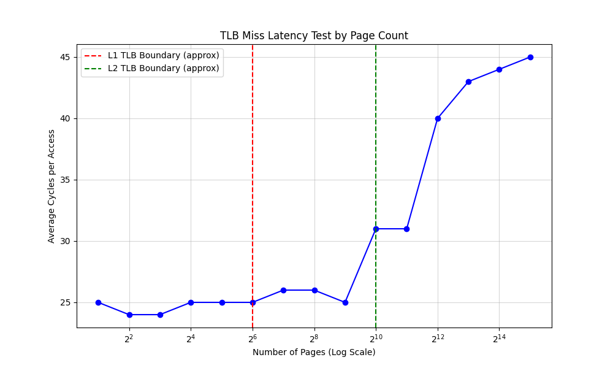
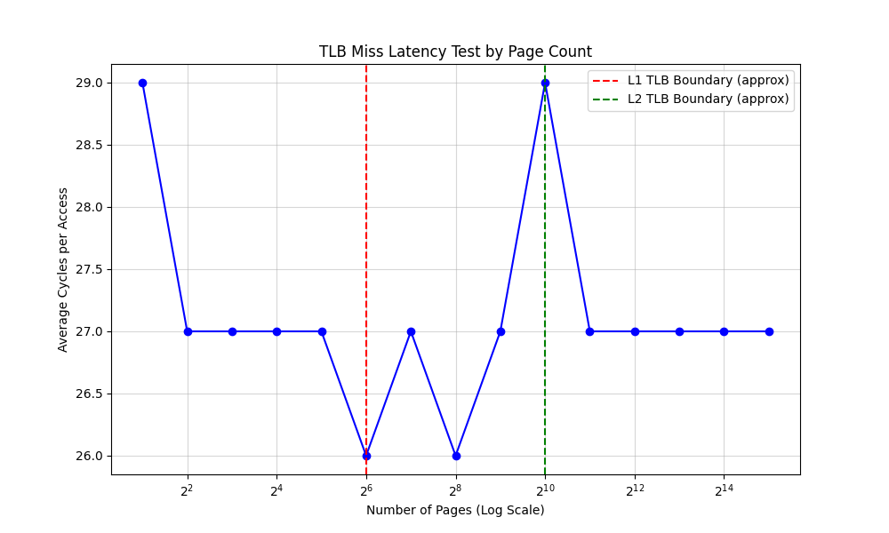
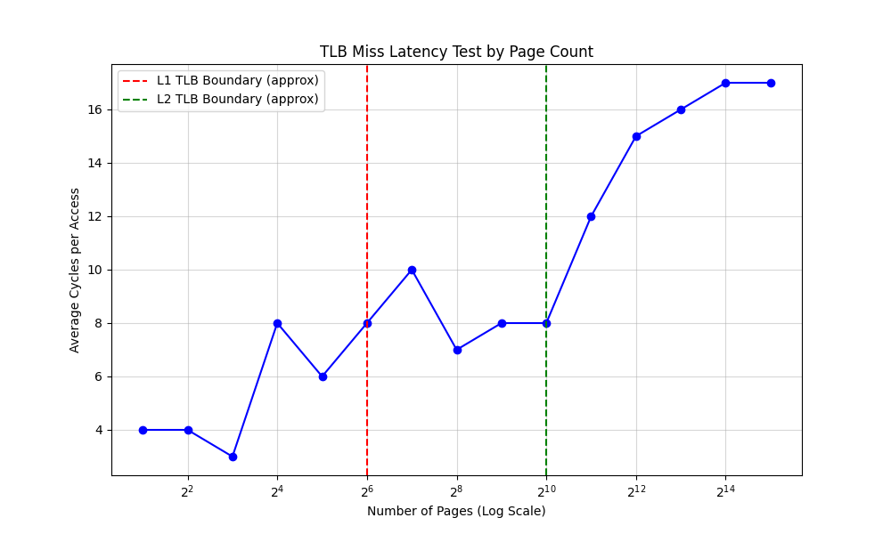

# OSTEP Chapter 22 Homework

본 장의 숙제는 여러 페이지를 참조하는 프로그램에서 참조하는 페이지의 개수를 늘림에 따라 TLB 성능에 어떠한 영향을 미치는지 알아보는 실험을 진행하는 것을 목표로 한다.

다음과 같은 사양의 CPU로 실험을 진행하였다.

**lscpu**

```bash
$ lscpu
Architecture:             x86_64
  CPU op-mode(s):         32-bit, 64-bit
  Address sizes:          39 bits physical, 48 bits virtual
  Byte Order:             Little Endian
CPU(s):                   8
  On-line CPU(s) list:    0-7
Vendor ID:                GenuineIntel
  Model name:             Intel(R) Core(TM) i7-1065G7 CPU @ 1.30GHz
    CPU family:           6
    Model:                126
    Thread(s) per core:   2
    Core(s) per socket:   4
    Socket(s):            1
    Stepping:             5
    CPU(s) scaling MHz:   86%
    CPU max MHz:          3900.0000
    CPU min MHz:          400.0000
```

## Codes

**tlb.c**

```c
#define _GNU_SOURCE
#include <stdio.h>
#include <stdlib.h>
#include <sched.h>
#include <x86intrin.h>
#include <unistd.h>

#define PAGE_SIZE 4096

void pin_to_core(int core_id) {
    cpu_set_t cpuset;
    CPU_ZERO(&cpuset);
    CPU_SET(core_id, &cpuset);

    // 현재 스레드를 지정 코어에 고정
    if (sched_setaffinity(0, sizeof(cpu_set_t), &cpuset) != 0) {
        perror("sched_setaffinity");
    } else {
        printf("스레드가 %d번 코어에 고정되었습니다.\n", core_id);
    }
}

int main(int argc, char* argv[]) {
    if (argc < 3) {
        return 1;
    }

    pin_to_core(0); // 0번 코어에 고정

    int num_pages = atoi(argv[1]);
    int iterations = atoi(argv[2]);

    // 1. 메모리 할당 및 물리 페이지 매핑 (Touch)
    size_t alloc_size = (size_t) num_pages * PAGE_SIZE;
    char* memory = (char*) malloc(alloc_size);
    if (!memory) {
        perror("Memory allocation failed");
        return 1;
    }

    for (int i = 0; i < num_pages; ++i) {
        memory[i * PAGE_SIZE] = 1;  // 실제 물리 메모리에 페이지 할당 강제
    }

    unsigned long long start, end;
    volatile char dummy;

    // 2. 실험: 랜덤 페이지 접근

    // 직렬화를 위해 lfence 사용 (이전 메모리 작업 완료 후 프로시저 실행 보장)
    _mm_lfence();
    start = __rdtsc();

    for (int i = 0; i < iterations; ++i) {
        // 매번 다른 페이지의 오프셋 0번지에 접근
        // 컴파일러가 rand()를 미리 계산하지 못하도록 루프 안에 배치
        int target = (rand() % num_pages) * PAGE_SIZE;
        dummy = memory[target];
    }

    _mm_lfence();
    end = __rdtsc();

    unsigned long long total_cycles = end - start;
    printf("--- 실험 결과 ---\n");
    printf("총 접근 페이지: %d개\n", num_pages);
    printf("총 시도 횟수: %d회\n", iterations);
    printf("총 소요 사이클: %llu\n", total_cycles);
    printf("접근 1회당 평균 사이클: %llu\n", total_cycles / iterations);

    free(memory);
    return 0;
}
```

**test.py**

```py
import subprocess
import re
import matplotlib.pyplot as plt

# 설정
EXECUTABLE = "./a.out"     # 컴파일된 C 프로그램 경로
ITERATIONS = 100000000     # 루프 횟수 고정
PAGE_COUNTS = [2**i for i in range(1, 16)]  # 2, 4, 8, ..., 32768
results = []

print(f"{'Pages':>10} | {'Avg Cycles':>15}")
print("-" * 30)

for count in PAGE_COUNTS:
    # 프로그램 실행 (taskset으로 0번 코어 고정 권장)
    try:
        cmd = ["taskset", "-c", "0", EXECUTABLE, str(count), str(ITERATIONS)]
        output = subprocess.check_output(cmd, universal_newlines=True)

        # 출력 결과에서 "평균 사이클: 숫자" 부분 추출
        match = re.search(r"평균 사이클: (\d+)", output)
        if match:
            avg_cycle = int(match.group(1))
            results.append(avg_cycle)
            print(f"{count:10d} | {avg_cycle:15d}")

    except Exception as e:
        print(f"Error running for {count} pages: {e}")
        break

# 2. 결과 시각화
plt.figure(figsize=(10, 6))
plt.plot(PAGE_COUNTS, results, marker='o', linestyle='-', color='b')

# X축을 로그 스케일로 설정 (2의 배수이므로 보기 편함)
plt.xscale('log', base=2)
plt.xlabel('Number of Pages (Log Scale)')
plt.ylabel('Average Cycles per Access')
plt.title('TLB Miss Latency Test by Page Count')
plt.grid(True, which="both", ls="-", alpha=0.5)

# TLB 임계점 예상선 표시 (예: L1 TLB 64, L2 TLB 1024)
plt.axvline(x=64, color='r', linestyle='--', label='L1 TLB Boundary (approx)')
plt.axvline(x=1024, color='g', linestyle='--', label='L2 TLB Boundary (approx)')
plt.legend()

plt.show()
```

## Problem 1

    시간을 재기위해서는 gettimeofday()를 통해서 만들 수 있는 타이머를 사용해야 할 것이다. 이 타이머는 얼마나 정확한가? 시간을 정확하게 재기 위해서는 타이머가 얼마나 길어야 하는가?(반복문 내에서 몇 번이나 페이지를 접근해야 시간을 정확히 잴 수 있는지를 결정하는 데 도움을 줄 것이다)

`gettimeofday()`는 정밀한 측정이 불가능하기 때문에 9장에서 컨텍스트 스위칭과 시스템 콜 성능 측정 실험을 진행할 때 사용한 `__rdtsc()`를 사용하였고 시간당 접근이 아닌 접근당 평균 사이클을 측정했다.

## Problem 2

    tlb.c 라는 프로그램을 작성하여 각 페이지를 접근하는 데 드는 대략적인 비용을 측정해 보자. 프로그램의 입력 값은 접근해야 하는 페이지들의 수와 시도 횟수이다.

작성한 **tlb.c**는 프로세스 친숙도를 설정하여 스레드를 0번 코어에 고정하고 참조될 메모리 주소에 데이터를 초기화하여 강제로 페이지 테이블을 갱신한 채로 측정을 시작한다.

숙제 요구사항에서 의도한 바는 모든 페이지마다 `iterations` 만큼 같은 페이지의 데이터를 참조하는 것이었겠지만 이 경우 현실적인 경우에서의 성능 차이를 판단하기가 어렵다고 판단하여 `iterations` 만큼 무작위한 페이지의 데이터를 참조하는 것으로 로직을 변경하였다.

## Problem 3

    선호하는 스크립트 언어 (csh, python 등)를 사용하여 프로그램을 실행시키는 스크립트를 작성하여 접근하는 페이지들의 수를 1부터 수천까지 2의 배수로 증가시키도록 해 보자. 다른 기계들에서 스크립트를 실행하여 데이터를 수집하자. 신뢰할 수 있는 측정치를 얻기 위해서는 몇 번이나 시도해 봐야 하는가?

작성한 **test.py**에서 `iterations`는 1억으로 고정, `num_pages`를 $2$ 부터 $2^15$ 까지 늘려가며 평균 사이클을 측정했다. 두 번 정도의 측정만으로 신뢰할 만한 그래프를 얻게 되었다.

## Problem 4

    그 다음으로 결과들을 사용하여 앞서 보인 그래프처럼 만들어 보자. ploticus와 같은 툴을 사용하면 된다. 시각화하는 것은 데이터를 좀 더 잘 이해하는 데 도움이 되는데, 왜 그런 것 같은가?



결과를 보면 페이지 개수가 $2^9$ 개일 때까지는 평균 사이클이 비슷하지만 $2^10$ 개일 때와 $2^12$ 개일 때 한 번씩 뚜렷한 증가가 발생하는 것을 관찰할 수 있다. 이를 통해 CPU와 가장 근접한 TLB 엔트리는 1,024개 정도 있다고 예측해볼 수 있다(실제로도 그러하다).

이 경우에 시각화가 데이터를 이해하는 데 더 도움이 되는 이유는 사실 TLB에 비해 아무리 메모리 접근 속도가 느리다고 해도 현대 하드웨어들은 아주 빠른 접근 속도를 보장하기 때문이다. 눈으로 보이는 숫자만으로는 성능 차이가 얼마나 큰지 직관적으로 확인하기 어렵다.

## Problem 5

    한 가지 주의해야 할 것은 컴파일러 최적화이다. 컴파일러는 프로그램의 다른 부분들이 사용하지 않는 변수를 반복문을 통해 증가시키는 부분을 빼버리는 등의 온밖 교묘한 짓들을 한다. 컴파일러가 작성한 TLB 크기 추정기를 어떻게 수정하여야 컴파일러가 주 반복문을 제거하지 않도록 만들 수 있을까?

사실 **tlb.c**에서 랜덤 참조 방식을 사용한 이유는 `iterations`를 활용한 루프 구현에서 컴파일러가 분기 예측을 할 가능성 때문이기도 하다. 그래서 `iterations` 루프에서 `rand()` 함수를 사용함으로써 분기 예측 가능성을 차단하였다.

## Problem 6

    또 한 가지 주의해야 할 것은 대부분의 시스템은 CPU가 여러 개이며, 각 CPU는 물론 각각의 TLB 계층을 밖고 있다. 정말 제대로 측정하기 위해서는 스케줄러가 하나의 CPU에서 또 다른 CPU로 이동시키지 못하도록 만들어서 하나의 CPU만을 사용해서 측정해야 할 것이다. 어떻게 그렇게 할 수 있을까? (힌트: 구글에서 “쓰레드 고정하기 (pinning a thread)”를 검색해 보자) 이렇게 하지 않았을 때는 어떤 일이 발생할까? 그리고 코드가 한 CPU에서 다른 CPU로 이동할 때 어떤 일이 발생할까?

**tlb.c** 시작 부분에서 CPU 친숙도 설정을 통해 항상 메인 쓰레드가 0번 코어에 고정되도록 하였다.

## Problem 7

    또 다른 발생할 수 있는 문제는 초기화와 관련되어 있다. 접근하기 전에 배열 a를 초기화하지 않는다면, 처음 a의 배열을 접근할 경우 한 번도 접근한 적이 없기 때문에 매우 비싼 비용이 들 것이다. 이 부분이 시간을 재는 데에 영향을 줄까? 이러한 잠재적인 비용 요인의 균형을 잡기 위해서 무엇을 할 수 있을까?

**tlb.c**에서 최초로 메모리 공간을 초기화하는 다음의 코드를 제거한 후 컴파일하고 다시 한번 실험을 진행했다.

```c
for (int i = 0; i < num_pages; ++i) {
    memory[i * PAGE_SIZE] = 1;  // 실제 물리 메모리에 페이지 할당 강제
}
```



결과는 위와 같았다. 몇 번이고 반복 측정을 해 보았지만 페이지의 개수가 아무리 많아도 일정하게 낮은 평균 사이클을 보였다.

이는 현대 운영체제의 지연 할당(Lazy Allocation)과 Zero Page 기법에 의한 것이다. 메모리 공간이 초기화되기 전까지 발생하는 모든 읽기 연산은 내용이 0으로 채워진 Zero Page를 제공함으로써 할당받은 페이지를 읽고 있다는 환상을 제공하는 것이다.

실제 운영체제는 요구 페이징(Demand Paging) 기법에 따라 초기화가 발생하기 전까지는 힙 메모리 공간을 예약만 해둘 뿐 실제로 가져오진 않는다. 그러므로 이 경우 초기화되지 않은 메모리 공간을 읽기만 하므로 모든 조건에서 Zero Page를 읽는 데 걸리는 시간만 필요하여 결과적으로 모든 사이클에서 평균 사이클 수가 유사하게 측정되는 것이다.

## Conclusion

숙제 요구사항에 따라 `iterations` 루프를 다음과 같이 작성하여 마지막 실험을 진행했다.

```c
for (int i = 0; i < iterations; ++i) {
    // 매번 다른 페이지의 오프셋 0번지에 접근
    // 컴파일러가 rand()를 미리 계산하지 못하도록 루프 안에 배치
    int target = (i % num_pages) * PAGE_SIZE;
    dummy = memory[target]++;
}
```



결과는 위 그림과 같이 변동 폭이 조금 있긴 하나, 여러 번에 실험에서 일관되게 페이지 개수가 16개가 되는 지점에서 일차적으로, 2,048개가 되는 지점에서 이차적으로 사이클의 증가가 있었다. 그러므로 실질적으로 TLB의 경계는 엔트리 16개, 2,048개 정도에 위치한다고 볼 수 있다.

이는 TLB 크기가 충분하지 않을 경우 코드의 공간 지역성이 우수한 것이 LRU 캐시 교체 알고리즘의 성능에 부정적인 영향을 끼칠 수 있음을 단적으로 나타낸다. 앞서 확인한 랜덤 참조 시의 그래프보다 증가 폭이 훨씬 가파르다. 증가 폭을 통해 비교하는 이유는 `rand()` 함수 자체에도 오버헤드가 있기 때문이다. 실제로 평균 사이클 횟수는 마지막 실험에서 훨씬 낮지만 사이클의 변화 추이를 통해 성능 차이를 더 확연히 발견할 수 있다.
