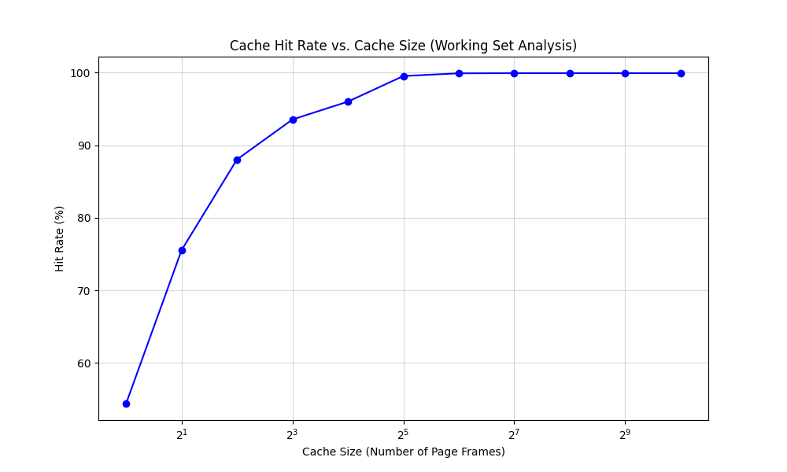

# OSTEP Chapter 24 Homework

## Problem 1

    다음 인자를 주고 랜덤 주소를 생성하라 : -s 0 -n 10, -s 1 -n 10, 그리고 -s 2 -n 10. FIFO 정책에서 LRU 정책으로 그리고 OPT 정책으로 변경하라. 생성된 주소 흐름의 모든 주소에 대해 히트인지 미스인지를 판별하라.

**paging-policy.py output**

```bash
# -s 0 -p FIFO
Access: 8  MISS FirstIn ->          [8] <- Lastin  Replaced:- [Hits:0 Misses:1]
Access: 7  MISS FirstIn ->       [8, 7] <- Lastin  Replaced:- [Hits:0 Misses:2]
Access: 4  MISS FirstIn ->    [8, 7, 4] <- Lastin  Replaced:- [Hits:0 Misses:3]
Access: 2  MISS FirstIn ->    [7, 4, 2] <- Lastin  Replaced:8 [Hits:0 Misses:4]
Access: 5  MISS FirstIn ->    [4, 2, 5] <- Lastin  Replaced:7 [Hits:0 Misses:5]
Access: 4  HIT  FirstIn ->    [4, 2, 5] <- Lastin  Replaced:- [Hits:1 Misses:5]
Access: 7  MISS FirstIn ->    [2, 5, 7] <- Lastin  Replaced:4 [Hits:1 Misses:6]
Access: 3  MISS FirstIn ->    [5, 7, 3] <- Lastin  Replaced:2 [Hits:1 Misses:7]
Access: 4  MISS FirstIn ->    [7, 3, 4] <- Lastin  Replaced:5 [Hits:1 Misses:8]
Access: 5  MISS FirstIn ->    [3, 4, 5] <- Lastin  Replaced:7 [Hits:1 Misses:9]

# -s 0 -p LRU
Access: 8  MISS LRU ->          [8] <- MRU Replaced:- [Hits:0 Misses:1]
Access: 7  MISS LRU ->       [8, 7] <- MRU Replaced:- [Hits:0 Misses:2]
Access: 4  MISS LRU ->    [8, 7, 4] <- MRU Replaced:- [Hits:0 Misses:3]
Access: 2  MISS LRU ->    [7, 4, 2] <- MRU Replaced:8 [Hits:0 Misses:4]
Access: 5  MISS LRU ->    [4, 2, 5] <- MRU Replaced:7 [Hits:0 Misses:5]
Access: 4  HIT  LRU ->    [2, 5, 4] <- MRU Replaced:- [Hits:1 Misses:5]
Access: 7  MISS LRU ->    [5, 4, 7] <- MRU Replaced:2 [Hits:1 Misses:6]
Access: 3  MISS LRU ->    [4, 7, 3] <- MRU Replaced:5 [Hits:1 Misses:7]
Access: 4  HIT  LRU ->    [7, 3, 4] <- MRU Replaced:- [Hits:2 Misses:7]
Access: 5  MISS LRU ->    [3, 4, 5] <- MRU Replaced:7 [Hits:2 Misses:8]

# -s 0 -p OPT
Access: 8  MISS Left  ->          [8] <- Right Replaced:- [Hits:0 Misses:1]
Access: 7  MISS Left  ->       [8, 7] <- Right Replaced:- [Hits:0 Misses:2]
Access: 4  MISS Left  ->    [8, 7, 4] <- Right Replaced:- [Hits:0 Misses:3]
Access: 2  MISS Left  ->    [7, 4, 2] <- Right Replaced:8 [Hits:0 Misses:4]
Access: 5  MISS Left  ->    [7, 4, 5] <- Right Replaced:2 [Hits:0 Misses:5]
Access: 4  HIT  Left  ->    [7, 4, 5] <- Right Replaced:- [Hits:1 Misses:5]
Access: 7  HIT  Left  ->    [7, 4, 5] <- Right Replaced:- [Hits:2 Misses:5]
Access: 3  MISS Left  ->    [4, 5, 3] <- Right Replaced:7 [Hits:2 Misses:6]
Access: 4  HIT  Left  ->    [4, 5, 3] <- Right Replaced:- [Hits:3 Misses:6]
Access: 5  HIT  Left  ->    [4, 5, 3] <- Right Replaced:- [Hits:4 Misses:6]
```

나머지 시드에 대한 결과 및 계산 과정은 생략한다.

## Problem 2

    캐시 크기가 5인 경우에 대해서 FIFO, LRU 그리고 MRU 정책을 사용할 때 최악의 주소 참조 스트림을 생성하라 (최악의 참조 스트림은 가능한 최대 개수의 미스를 발생시킨다). 최악의 참조 스트림의 경우 성능을 극적으로 향상시켜 OPT의 성능에 근접하게 만들려면 캐시의 크기는 얼마나 커야 하는가?

**FIFO 정책의 최악의 주소 참조 스트림**

```bash
$ python paging-policy.py -a 1,2,3,4,5,6,1,2,3,4,5,6 -C 5 -c
ARG addresses 1,2,3,4,5,6,1,2,3,4,5,6
ARG addressfile
ARG numaddrs 10
ARG policy FIFO
ARG clockbits 2
ARG cachesize 5
ARG maxpage 10
ARG seed 0
ARG notrace False

Solving...

Access: 1  MISS FirstIn ->          [1] <- Lastin  Replaced:- [Hits:0 Misses:1]
Access: 2  MISS FirstIn ->       [1, 2] <- Lastin  Replaced:- [Hits:0 Misses:2]
Access: 3  MISS FirstIn ->    [1, 2, 3] <- Lastin  Replaced:- [Hits:0 Misses:3]
Access: 4  MISS FirstIn -> [1, 2, 3, 4] <- Lastin  Replaced:- [Hits:0 Misses:4]
Access: 5  MISS FirstIn -> [1, 2, 3, 4, 5] <- Lastin  Replaced:- [Hits:0 Misses:5]
Access: 6  MISS FirstIn -> [2, 3, 4, 5, 6] <- Lastin  Replaced:1 [Hits:0 Misses:6]
Access: 1  MISS FirstIn -> [3, 4, 5, 6, 1] <- Lastin  Replaced:2 [Hits:0 Misses:7]
Access: 2  MISS FirstIn -> [4, 5, 6, 1, 2] <- Lastin  Replaced:3 [Hits:0 Misses:8]
Access: 3  MISS FirstIn -> [5, 6, 1, 2, 3] <- Lastin  Replaced:4 [Hits:0 Misses:9]
Access: 4  MISS FirstIn -> [6, 1, 2, 3, 4] <- Lastin  Replaced:5 [Hits:0 Misses:10]
Access: 5  MISS FirstIn -> [1, 2, 3, 4, 5] <- Lastin  Replaced:6 [Hits:0 Misses:11]
Access: 6  MISS FirstIn -> [2, 3, 4, 5, 6] <- Lastin  Replaced:1 [Hits:0 Misses:12]

FINALSTATS hits 0   misses 12   hitrate 0.00
```

**LRU 정책의 최악의 주소 참조 스트림**

```bash
$ python paging-policy.py -a 1,2,3,4,5,6,1,2,3,4,5,6 -C 5 -p LRU -c
ARG addresses 1,2,3,4,5,6,1,2,3,4,5,6
ARG addressfile
ARG numaddrs 10
ARG policy LRU
ARG clockbits 2
ARG cachesize 5
ARG maxpage 10
ARG seed 0
ARG notrace False

Solving...

Access: 1  MISS LRU ->          [1] <- MRU Replaced:- [Hits:0 Misses:1]
Access: 2  MISS LRU ->       [1, 2] <- MRU Replaced:- [Hits:0 Misses:2]
Access: 3  MISS LRU ->    [1, 2, 3] <- MRU Replaced:- [Hits:0 Misses:3]
Access: 4  MISS LRU -> [1, 2, 3, 4] <- MRU Replaced:- [Hits:0 Misses:4]
Access: 5  MISS LRU -> [1, 2, 3, 4, 5] <- MRU Replaced:- [Hits:0 Misses:5]
Access: 6  MISS LRU -> [2, 3, 4, 5, 6] <- MRU Replaced:1 [Hits:0 Misses:6]
Access: 1  MISS LRU -> [3, 4, 5, 6, 1] <- MRU Replaced:2 [Hits:0 Misses:7]
Access: 2  MISS LRU -> [4, 5, 6, 1, 2] <- MRU Replaced:3 [Hits:0 Misses:8]
Access: 3  MISS LRU -> [5, 6, 1, 2, 3] <- MRU Replaced:4 [Hits:0 Misses:9]
Access: 4  MISS LRU -> [6, 1, 2, 3, 4] <- MRU Replaced:5 [Hits:0 Misses:10]
Access: 5  MISS LRU -> [1, 2, 3, 4, 5] <- MRU Replaced:6 [Hits:0 Misses:11]
Access: 6  MISS LRU -> [2, 3, 4, 5, 6] <- MRU Replaced:1 [Hits:0 Misses:12]

FINALSTATS hits 0   misses 12   hitrate 0.00
```

**MRU 정책의 최악의 주소 참조 스트림**

```bash
$ python3 paging-policy.py -a 1,2,3,4,5,6,7,8,9,10,6,7,8,9,10 -C 5 -p MRU -c
ARG addresses 1,2,3,4,5,6,7,8,9,10,6,7,8,9,10
ARG addressfile
ARG numaddrs 10
ARG policy MRU
ARG clockbits 2
ARG cachesize 5
ARG maxpage 10
ARG seed 0
ARG notrace False

Solving...

Access: 1  MISS LRU ->          [1] <- MRU Replaced:- [Hits:0 Misses:1]
Access: 2  MISS LRU ->       [1, 2] <- MRU Replaced:- [Hits:0 Misses:2]
Access: 3  MISS LRU ->    [1, 2, 3] <- MRU Replaced:- [Hits:0 Misses:3]
Access: 4  MISS LRU -> [1, 2, 3, 4] <- MRU Replaced:- [Hits:0 Misses:4]
Access: 5  MISS LRU -> [1, 2, 3, 4, 5] <- MRU Replaced:- [Hits:0 Misses:5]
Access: 6  MISS LRU -> [1, 2, 3, 4, 6] <- MRU Replaced:5 [Hits:0 Misses:6]
Access: 7  MISS LRU -> [1, 2, 3, 4, 7] <- MRU Replaced:6 [Hits:0 Misses:7]
Access: 8  MISS LRU -> [1, 2, 3, 4, 8] <- MRU Replaced:7 [Hits:0 Misses:8]
Access: 9  MISS LRU -> [1, 2, 3, 4, 9] <- MRU Replaced:8 [Hits:0 Misses:9]
Access: 10  MISS LRU -> [1, 2, 3, 4, 10] <- MRU Replaced:9 [Hits:0 Misses:10]
Access: 6  MISS LRU -> [1, 2, 3, 4, 6] <- MRU Replaced:10 [Hits:0 Misses:11]
Access: 7  MISS LRU -> [1, 2, 3, 4, 7] <- MRU Replaced:6 [Hits:0 Misses:12]
Access: 8  MISS LRU -> [1, 2, 3, 4, 8] <- MRU Replaced:7 [Hits:0 Misses:13]
Access: 9  MISS LRU -> [1, 2, 3, 4, 9] <- MRU Replaced:8 [Hits:0 Misses:14]
Access: 10  MISS LRU -> [1, 2, 3, 4, 10] <- MRU Replaced:9 [Hits:0 Misses:15]

FINALSTATS hits 0   misses 15   hitrate 0.00
```

첫 참조열의 경우 반복문에서 빈번히 발생하는 참조 패턴이다. 만약 캐시의 크기보다 조금이라도 더 많은 개수의 페이지가 반복문의 패턴으로 참조될 경우 히트율은 0%이다. 이때 참조되는 페이지의 종류 수를 $P$, 캐시의 크기를 $C$ 이라고 하면 $C \ge P$ 를 만족해야만 OPT의 성능에 근접할 수 있다. 이 패턴의 경우 FIFO와 LRU은 같은 방식으로 가장 오래 전에 참조된 페이지를 제거하지만 이는 곧 다시 참조될 페이지이기 때문에 캐시의 크기를 비약적으로 늘리는 것 외에 해결책은 없다.

마지막 참조열의 경우 처음 캐시에 적재된 페이지들은 지역성을 갖지 않지만 나머지 페이지 참조가 지역성을 띠고 있는 형태이다. 충분히 발생할 법한 참조 패턴이다. 하지만 MRU는 캐시에 적재된 페이지들이 한 번쯤은 히트되기를 기대한다. 그것도 지역성을 갖고 히트되는 것이 아니라 조금은 무작위하게 히트되기를 기대하는 것이다. 그렇게 하면 최소한 캐시 크기 정도의 히트 횟수는 보장될 수 있고, 캐시에 적재된 페이지들이 한 번씩은 히트되는 것을 보장한다(끝의 교체가 빈번하게 발생하는 슬롯 제외). 하지만 지역성을 가진 위 참조 패턴에서는 LRU 또는 OPT 알고리즘의 동작이 훨씬 정확하다. 그리고 이 경우에는 캐시 크기를 늘리더라도 참조 패턴에 따라서는 그것이 아무런 소용이 없을 수도 있다. MRU 알고리즘의 가정인 "최근에 참조된 페이지는 앞으로 참조될 가능성이 낮을 것이다."가 깨지는 순간 캐시의 한 슬롯에서만 반복적으로 페이지 교체가 발생할 것이며, 또한 그 가정은 쉽게 깨진다.

## Problem 3

    랜덤한 추적 기록을 생성하라 (python 또는 perl을 사용하라). 이런 추적 기록을 적용할 때 여러 정책이 어떻게 동작할 것이라고 예상하는가?

정책별로 무작위한 참조열에 대한 성능에 대해 논해 보겠다.

일단 이에 대해 어떤 페이지 정책이 우수한지 비교하는 것은 의미가 없다. 수많은 참조 패턴들 중 특정 정책이 이득을 볼 수 있는 참조 패턴이 생성될 확률은 극히 낮기 때문이다. 그리고 과거의 정보가 미래의 정보를 예측하기 위한 척도가 될 수 없다.

하지만 이 경우에도 OPT 알고리즘은 최선의 페이지 교체 전략을 보장한다. 이때의 OPT 알고리즘의 동작은 가장 나중에 참조될 페이지를 제거함으로써 나머지 페이지가 참조될 가능성을 높이는 것이다.

위 알고리즘들은 모두 결정론적이지만 유일하게 비결정론적인 RANDOM 알고리즘이 유일하게 OPT 알고리즘보다 평균적으로 낮은 성능을 보이면서도 나머지 현실적인 알고리즘보다 좋은 성능을 보일 가능성이 있다. 특정 패턴에 의해 편향되지 않고 일관된 성능을 보장하기 때문이다.

## Problem 4

    얼마간 지역성을 보이는 추적 기록을 생성하라. 그런 추적 기록을 어떻게 생성할 수 있을까? 생성된 추적 기록대로 메모리 참조가 일어날 때 LRU의 성능은 어떤가? RAND는 LRU에 비해서 얼마나 더 좋은 성능을 보이는가? CLOCK은 어떤 성능을 보이는가? 시계 비트의 수를 변경하였을 때 CLOCK은 어떤 성능을 보이는가?

**generator.py**

```py
import random

def generate_locality_trace(total_pages, hot_pages_count, length, hot_ratio=0.8):
    hot_pages = list(range(1, hot_pages_count + 1))
    cold_pages = list(range(hot_pages_count + 1, total_pages + 1))

    trace = []
    for _ in range(length):
        if random.random() < hot_ratio:
            trace.append(random.choice(hot_pages))
        else:
            trace.append(random.choice(cold_pages))
    return trace

# 1. 참조 패턴 생성
CACHE_SIZE = 6
generated_trace = generate_locality_trace(total_pages=30, hot_pages_count=6, length=200, hot_ratio=0.20)
generated_trace.extend(generate_locality_trace(total_pages=30, hot_pages_count=6, length=300, hot_ratio=0.80))
generated_trace.extend(generate_locality_trace(total_pages=30, hot_pages_count=6, length=500, hot_ratio=0.20))

# 2. 파일로 출력 (comma-separated)
file_name = "memory_trace.txt"

try:
    with open(file_name, "w", encoding="utf-8") as f:
        # 리스트의 모든 요소를 문자열로 바꾸고 콤마로 연결
        trace_string = "\n".join(map(str, generated_trace))
        f.write(trace_string)

    print(f"성공적으로 '{file_name}' 파일이 생성되었습니다.")
    print(f"내용 샘플: {trace_string[:50]}...")
except IOError as e:
    print(f"파일 생성 중 오류 발생: {e}")
```

원서에는 '얼마간의 지역성'이 'some locality'로 표기되어 있다. 따라서 총 1,000회의 참조에서 30%는 80:20 법칙에 의해 생성되고 나머지는 완전히 무작위하게 생성되도록 설정하였다. 이에 따라 도출되는 각 정책별 성능 지표는 다음과 같다.

- `OPT`: FINALSTATS hits 546 misses 454 hitrate 54.60
- `LRU`: FINALSTATS hits 303 misses 697 hitrate 30.30
- `RAND`: FINALSTATS hits 288 misses 712 hitrate 28.80
- `CLOCK`: FINALSTATS hits 291 misses 709 hitrate 29.10 (`-b 1`) ~ FINALSTATS hits 310 misses 690 hitrate 31.00 (`-b 3`)

참조 지역성이 발생하는 구간을 30% 정도로 설정했을 때까지는 LRU 정책의 성능 지표가 랜덤 정책의 성능 지표보다 약간 우수하다. 구간이 20% 정도일 때부터 LRU 정책보다 랜덤 정책의 성능이 약간씩 우수해지게 된다. 시계 정책 또한 LRU, RAND와 비슷한 성능 지표를 보이고 있으며 시계 비트의 수를 3으로 설정했을 때 미세하게 다른 성능 지표들을 앞섰다. 하지만 시계 비트의 수가 늘어난다고 해서 성능이 그에 비례하여 개선되지는 않는다.

## Problem 5

    Valgrind와 같은 프로그램을 사용하여 실제 응용 프로그램으로부터 정보를 추출하여 가상 페이지 참조 스트림을 생성하라. 예를 들어, valgrind --tool=lackey --trace-mem=yes ls 명령어를 실행시키면 ls 프로그램에 의해서 참조된 모든 명령과 데이터에 대한 거의 완벽한 참조 추적 기록을 출력할 것이다. 이 정보를 시뮬레이터에서 사용하기 위해서는 먼저 가상 메모리 참조를 가상 페이지 번호 참조로 변환해야 한다. 가상 주소의 오프셋 부분을 제거한 후 (masking of), 오프셋 비트 수만큼 오른쪽으로 시프트하면 된다. 당신의 응용 프로그램의 경우, 참조 요청의 대부분을 만족시키는 캐시의 크기는 얼마인가? 캐시의 크기가 증가할 때 응용 프로그램의 작은 집합의 변화를 그래프로 나타내어라.

일단 `valgrind` 명령어를 수행하면 다음과 같이 메모리 참조에 대한 추적 기록이 생성된다.

**valgrind 실행 결과**

```bash
$ valgrind --tool=lackey --trace-mem=yes ls
...
I  048d1b74,5
I  048d1a2e,3
I  048d1a31,5
 S 1ffefff9f8,8
I  04978200,4
I  04978204,7
 L 04a8cdf8,8
I  0497820b,5
I  04978210,2
I  04978219,2
I  0497821b,2
==193445==
==193445== Counted 0 calls to main()
==193445==
==193445== Jccs:
==193445==   total:         113,761
==193445==   taken:         42,692 (38%)
==193445==
==193445== Executed:
==193445==   SBs entered:   119,601
==193445==   SBs completed: 73,698
==193445==   guest instrs:  659,853
==193445==   IRStmts:       4,323,677
==193445==
==193445== Ratios:
==193445==   guest instrs : SB entered  = 55 : 10
==193445==        IRStmts : SB entered  = 361 : 10
==193445==        IRStmts : guest instr = 65 : 10
==193445==
==193445== Exit code:       0
```

사용 중인 운영체제의 페이지 크기는 $4\text{KB}(=2^{12}\text{Bit})$ 이므로 하위 12개의 비트를 절삭하면 VPN을 추출할 수 있다. 이 VPN 정보를 토대로 작업 집합(Working Set) 크기의 변화에 따른 페이지 히트율을 계산할 수 있다.

다음은 출력 행 추출, 비트 쉬프트, LRU 페이지 교체 정책에 따라 작업 집합 크기에 따른 히트율 계산을 수행하는 파이썬 시뮬레이터 프로그램이다.

**simulator.py**

```py
import matplotlib.pyplot as plt
from collections import deque

def simulate_lru(trace_file, cache_size, page_size_bits=12):
    """
    LRU 캐시 시뮬레이터
    - page_size_bits: 12 (4KB 페이지 기준)
    """
    cache = deque()
    hits = 0
    total = 0

    with open(trace_file, 'r') as f:
        for line in f:
            # Lackey 출력 형식: " I  04015f60, 2" 또는 " L  04201c10, 4"
            parts = line.split()
            if len(parts) < 2: continue

            try:
                # 16진수 주소 추출 및 VPN 변환 (오프셋 제거를 위해 비트 시프트)
                addr = int(parts[1].split(',')[0], 16)
                vpn = addr >> page_size_bits

                total += 1

                if vpn in cache:
                    hits += 1
                    # 사용된 페이지를 가장 최근(오른쪽)으로 이동
                    cache.remove(vpn)
                    cache.append(vpn)
                else:
                    if len(cache) >= cache_size:
                        cache.popleft() # 가장 오래된 페이지 제거
                    cache.append(vpn)
            except ValueError:
                continue

    return (hits / total) * 100 if total > 0 else 0

# --- 시뮬레이션 실행 ---
trace_path = 'trace.txt'  # Valgrind 추출 파일 경로
cache_sizes = [1, 2, 4, 8, 16, 32, 64, 128, 256, 512, 1024] # 페이지 프레임 개수
hit_rates = []

print("시뮬레이션 시작...")
for size in cache_sizes:
    rate = simulate_lru(trace_path, size)
    hit_rates.append(rate)
    print(f"Cache Size: {size:4} pages | Hit Rate: {rate:.2f}%")

# --- 결과 시각화 ---
plt.figure(figsize=(10, 6))
plt.plot(cache_sizes, hit_rates, marker='o', linestyle='-', color='b')
plt.title('Cache Hit Rate vs. Cache Size (Working Set Analysis)')
plt.xlabel('Cache Size (Number of Page Frames)')
plt.ylabel('Hit Rate (%)')
plt.xscale('log', base=2) # X축을 로그 스케일로 설정하여 가독성 증대
plt.grid(True, which="both", ls="-", alpha=0.5)
plt.show()
```

**실행 결과**

```bash
$ valgrind --tool=lackey --trace-mem=yes ls 2>&1 | grep -E '^( I| L| S)' > trace.txt
$ python3 simulator.py
시뮬레이션 시작...
Cache Size:    1 pages | Hit Rate: 54.42%
Cache Size:    2 pages | Hit Rate: 75.54%
Cache Size:    4 pages | Hit Rate: 88.03%
Cache Size:    8 pages | Hit Rate: 93.54%
Cache Size:   16 pages | Hit Rate: 96.00%
Cache Size:   32 pages | Hit Rate: 99.52%
Cache Size:   64 pages | Hit Rate: 99.90%
Cache Size:  128 pages | Hit Rate: 99.92%
Cache Size:  256 pages | Hit Rate: 99.92%
Cache Size:  512 pages | Hit Rate: 99.92%
Cache Size: 1024 pages | Hit Rate: 99.92%
```



작업 집합의 크기가 $2^5$ 이상이 되는 순간부터 대부분의 경우 페이지 히트가 발생하고, $2^7$ 이상이 되는 순간부터는 페이지 히트율이 고정된다.
